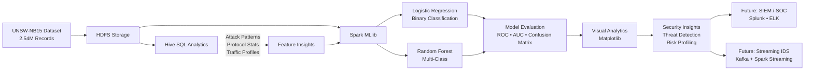

# 🛡️ Intrusion Detection with Big Data Analytics (UNSW-NB15)

## 📌 Overview
This project builds a **distributed cybersecurity machine learning pipeline** using:

- Apache Hive (SQL analytics)
- Apache Spark MLlib (Logistic Regression, Random Forest)
- Hadoop/HDFS (Big Data storage)

Dataset: **UNSW-NB15 (2.54M network traffic records)**

---

## 🎯 Objectives
- Detect cyberattacks using ML classification  
- Analyze protocol/traffic distributions using Hive  
- Evaluate Big Data scaling behavior in Spark  

---

## 🛠️ Stack
`Hive` · `PySpark` · `HDFS` · `pandas` · `matplotlib`  

---

## 🔬 Workflow Summary

### **1. Hive Data Exploration**
- Ingested CSV → Hive tables  
- Queried:
  - attack categories  
  - protocol distribution  
  - byte/packet patterns  
- Identified **heavy-tailed traffic** typical of malicious flows  

---

## 🧭 Big Data Intrusion Detection Pipeline 

_This figure outlines end-to-end Big Data Intrusion Detection pipeline integrating Hive, Spark MLlib, and HDFS for large-scale cybersecurity analytics._

---

### **2. Spark ML Models**

| Model | Type | Accuracy | AUC |
|-------|------|----------|------|
| Logistic Regression | Binary | 96.7% | **0.987** |
| Random Forest | Multi-class | 92–94% | 0.95+ |

Results demonstrate Spark MLlib handles multi-million record datasets efficiently.

---

### **3. Visual Analytics**
- ROC curve  
- Correlation matrix  
- Confusion matrix  
- Feature importance  

---

## 📊 Deliverables
- Hive SQL scripts  
- PySpark training notebook  
- Evaluation plots  
- Reproducible pipeline  

---

## 🚀 Next Steps
- Add **Kafka + Spark Streaming** for real-time IDS  
- Export features → SIEM (Splunk / ELK)  
- Test Gradient Boosting or deep learning models  

---
# Placeholder - content coming soon
