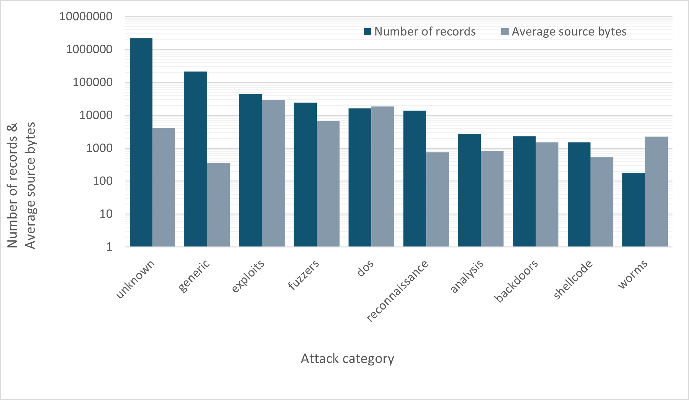
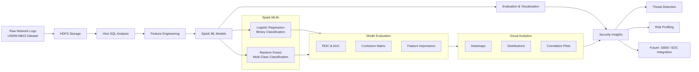
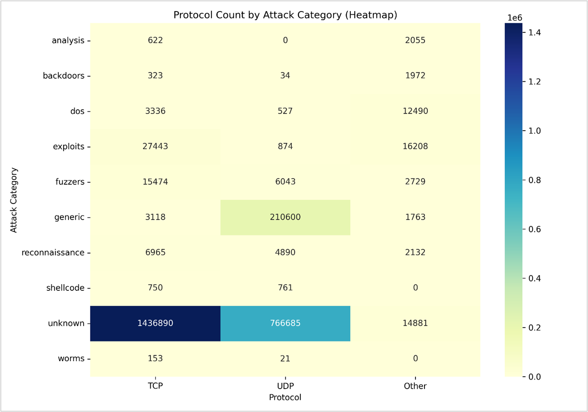
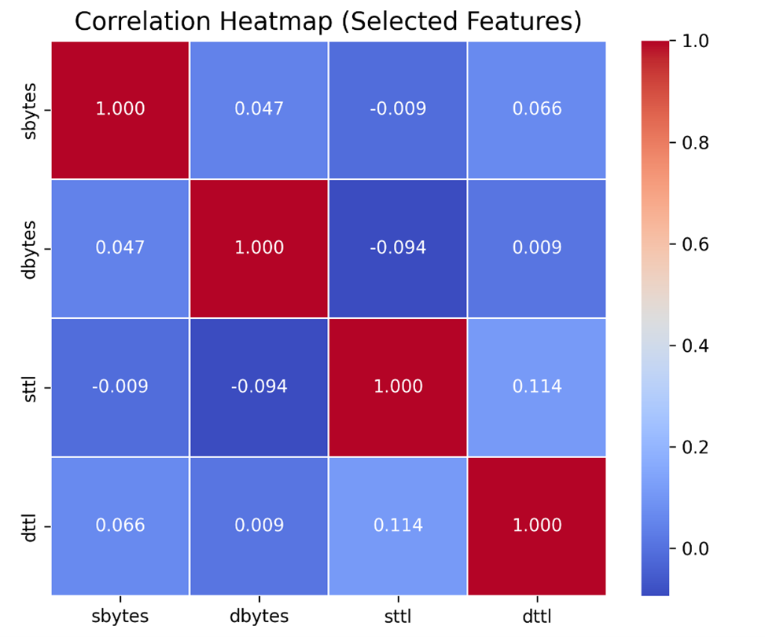
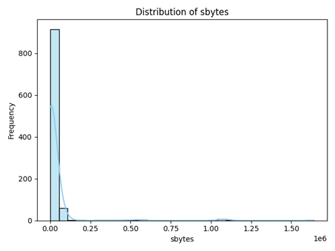
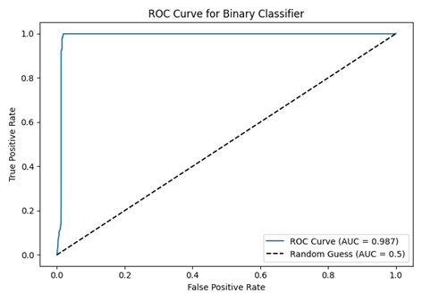
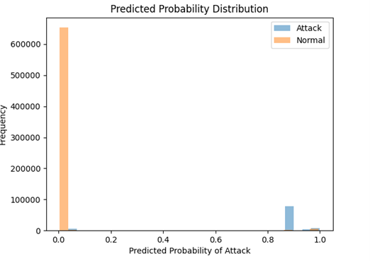
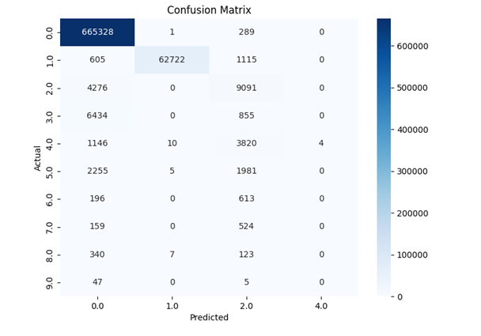

# 🛡️ Intrusion Detection with Big Data Analytics (UNSW-NB15)

## 📌 Overview
This project builds a **distributed cybersecurity machine learning pipeline** using:

- Apache Hive (SQL analytics)
- Apache Spark MLlib (Logistic Regression, Random Forest)
- Hadoop/HDFS (Big Data storage)

Dataset: **UNSW-NB15 (2.54M network traffic records)**

---

## 🎯 Objectives
- Detect cyberattacks using ML classification  
- Analyze protocol/traffic distributions using Hive  
- Evaluate Big Data scaling behavior in Spark  

---

## 🛠️ Stack
`Hive` · `PySpark` · `HDFS` · `pandas` · `matplotlib`  

---

## 🔬 Workflow Summary

### 1. Hive Data Exploration
- Ingested CSV → Hive tables  
- Queried:
  - attack categories  
  - protocol distribution  
  - byte/packet patterns  
- Identified **heavy-tailed traffic** typical of malicious flows  

**Figure:** Attack Category Distribution by Record Count and Average Source Bytes (Logarithmic Scale)

This visualization highlights the heavy-tailed nature of network traffic in the UNSW-NB15 dataset. While "unknown" (normal) and "generic" attacks dominate in frequency, categories such as "exploits" and "fuzzers" show significantly higher average source bytes, suggesting more data-intensive malicious behavior.

---

## 🧭 Big Data Intrusion Detection Pipeline 

**Figure:** End-to-end Big Data Intrusion Detection pipeline integrating Hive, Spark MLlib, and HDFS for large-scale cybersecurity analytics.

---

### 2. Spark ML Models

| Model | Type | Accuracy | AUC |
|-------|------|----------|------|
| Logistic Regression | Binary | 96.7% | **0.987** |
| Random Forest | Multi-class | 92–94% | 0.95+ |

Results demonstrate Spark MLlib handles multi-million record datasets efficiently.

---

### 3. Visual Analytics
- ROC curve  
- Correlation matrix  
- Confusion matrix  
- Feature importance  

---

## 📈 Visual Analytics & Model Evaluation

This project includes comprehensive visual analysis to validate data behavior, feature relationships, and model performance.

### 🔍 Traffic Patterns by Attack Category

Shows protocol usage (TCP/UDP/Other) across attack types.  
Highlights heavy TCP usage for unknown and exploit-based attacks.

---

### 🔗 Feature Correlation Analysis

Low correlations between key features (`sbytes`, `dbytes`, `sttl`, `dttl`) indicate good feature diversity for ML modeling.

---

### 📊 Distribution of Source Bytes

Reveals a **heavy-tailed distribution**, common in malicious network traffic, validating the dataset’s realism.

---

### 📈 ROC Curve – Binary Classifier

**AUC = 0.987**, demonstrating strong separation between attack and normal traffic.

---

### 🎯 Predicted Probability Distribution

Shows clear confidence separation between attack and normal predictions.

---

### 📉 Confusion Matrix (Multi-Class)

Highlights strong classification performance across most attack categories, with some overlap in rare classes.

---

## 📊 Deliverables
- Hive SQL scripts  
- PySpark training notebook  
- Evaluation plots  
- Reproducible pipeline  

---

## 🚀 Next Steps
- Add **Kafka + Spark Streaming** for real-time IDS  
- Export features → SIEM (Splunk / ELK)  
- Test Gradient Boosting or deep learning models  

---

**Academic Disclosure:**  
This project is based on coursework submitted as part of an MSc in Big Data Technologies.  
All analysis, code, and visualizations were independently produced by the author.  
No confidential or proprietary materials are included.
