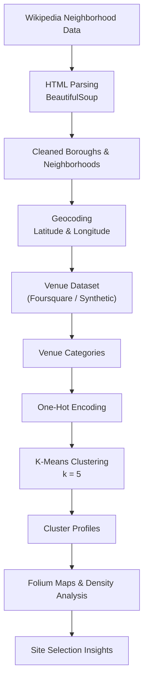
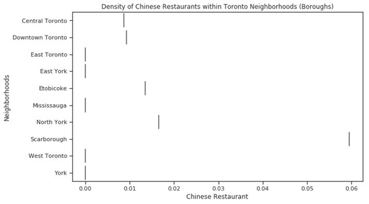
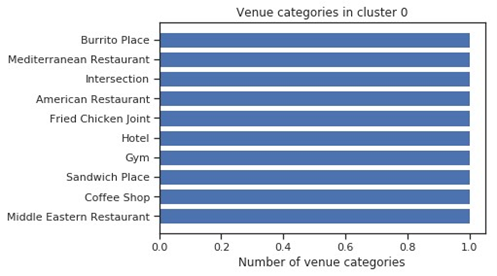
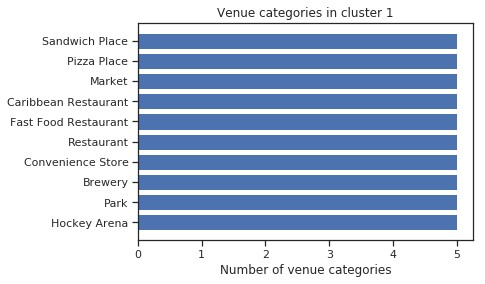
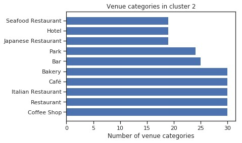
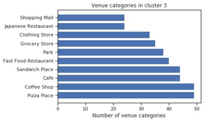
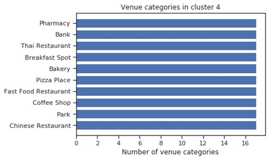
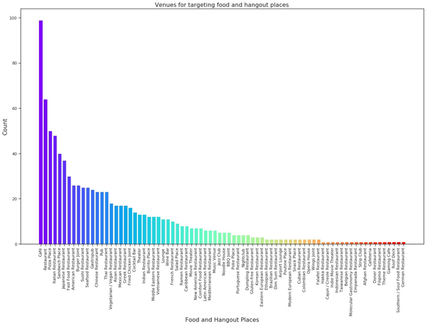
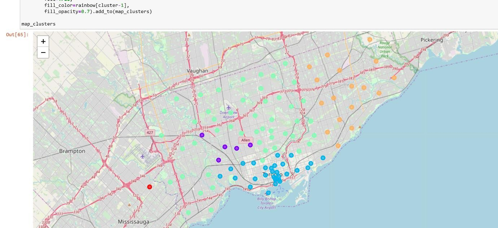
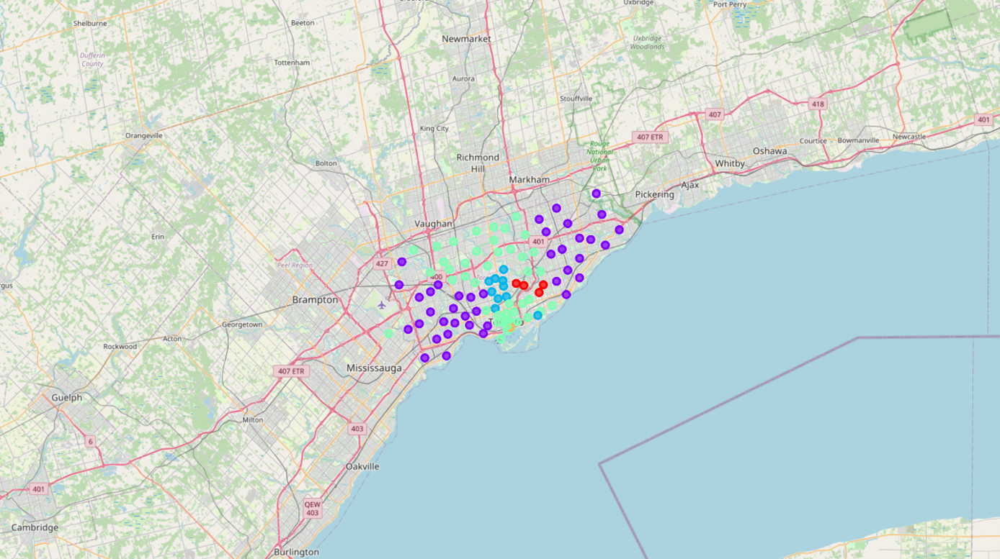

# 🗺️ Location Intelligence — Chinese Restaurant Site Selection (Toronto)

[](https://www.python.org/)
[](https://pandas.pydata.org/)
[](https://scikit-learn.org/)
[](https://python-visualization.github.io/folium/)

---

## Executive Summary

This project applies **location intelligence** and **unsupervised machine learning** to identify **underserved neighborhoods** for Chinese restaurant expansion in Toronto, Canada.

Originally developed as part of the **IBM Data Science Professional Certificate Capstone**, the project has been **modernized for portfolio use**, preserving methodological rigor while ensuring reproducibility despite legacy API deprecation.

**Outcome:**  
A reusable **location-intelligence decision framework** that identifies **high-opportunity, low-competition neighborhoods** through spatial clustering, venue density modeling, and interactive geospatial visualization.

---

## Business Problem

Toronto is one of North America’s most diverse food markets, yet restaurant density varies significantly across neighborhoods.

**Key question:**  
> *Which Toronto neighborhoods show strong market potential for a new Chinese restaurant based on existing venue patterns?*

---

## Approach & Methodology

### Data Sources

- **Neighborhoods & Boroughs:** Wikipedia (scraped using BeautifulSoup)
- **Geographic Coordinates:** Public postal-code geospatial dataset
- **Venue Data:**
  - Originally collected via the Foursquare Places API
  - For reproducibility, a **synthetic venue dataset with identical schema** was used due to API deprecation

> ⚠️ Synthetic data preserves venue categories, relative density, and spatial structure to demonstrate the full analytical workflow without reliance on live APIs.

---

## Tech Stack

| Layer | Tools |
|-----|------|
| Data Wrangling | `pandas`, `BeautifulSoup` |
| Geocoding | `Geopy` |
| Feature Engineering | One-Hot Encoding |
| Machine Learning | `scikit-learn` (K-Means) |
| Visualization | `matplotlib`, `seaborn`, `folium` |
| Mapping | Interactive Folium Maps |

---

## Analytical Workflow



---

## Key Visual Results

---

### 1️⃣ Density of Chinese Restaurants by Borough



*Figure 1. Density of Chinese restaurants by borough (violin plot).*

This visualization highlights boroughs with **low or zero Chinese restaurant density**, revealing potential market gaps.

**Key Insight — High Opportunity Zones:**
- East York  
- York  
- West Toronto  
- Mississauga  

These boroughs show minimal saturation and represent strong expansion candidates.

---

### 2️⃣ Venue Composition by Cluster  
*(Top 10 venue categories per cluster)*

---

#### 🔴 Cluster 0 — Sparse / Transitional Areas



*Figure 2. Top venue categories in Cluster 0.*

- Low venue diversity  
- Minimal presence of Chinese restaurants  
- Early-stage or transitional commercial areas  

---

#### 🟣 Cluster 1 — Community & Recreation-Focused Neighborhoods



*Figure 3. Top venue categories in Cluster 1.*

- Dominated by parks, markets, convenience stores, and casual dining  
- Limited Chinese restaurant presence  
- Suitable for community-oriented food services  

---

#### 🔵 Cluster 2 — Downtown & Entertainment-Oriented Districts



*Figure 4. Top venue categories in Cluster 2.*

- Cafés, restaurants, bars, bakeries, and hotels dominate  
- High commercial activity and foot traffic  
- Indicates **high competition** and dense mixed-use urban zones  

---

#### 🟢 Cluster 3 — Residential–Commercial Mix



*Figure 5. Top venue categories in Cluster 3.*

- Coffee shops, pizza places, grocery stores, cafés, and fast food dominate  
- Reflects stable residential demand  
- Moderate competition — suitable for neighborhood-scale restaurants  

---

#### 🟠 Cluster 4 — High Chinese Restaurant Density (Scarborough)



*Figure 6. Top venue categories in Cluster 4.*

- Chinese restaurants appear prominently  
- Indicates market saturation driven by established cultural demand  
- Less attractive for new low-competition entrants  

---

### 3️⃣ Overall Venue Distribution — Food & Hangout Places



*Figure 7. Distribution of 78 food and hangout venue categories across Toronto neighborhoods.*

Chinese restaurants rank **mid-level among 78 categories**, suggesting that while competition exists, **significant expansion potential remains** in underserved clusters.

---

### 4️⃣ Geospatial Clustering Maps (Original & Reproducible)

---

#### Original Clustering Map — IBM Capstone Results



*Figure 8. Original K-Means clustering of Toronto neighborhoods using Foursquare venue data (IBM Capstone project).*

This map represents the **original analytical outcome** of the project, generated using the Foursquare Places API prior to its deprecation.

- Five distinct neighborhood clusters  
- Orange cluster highlights areas with high Chinese restaurant density  
- Spatial patterns align with venue composition and density analyses  
- Serves as the **primary basis for business conclusions**

> *The original interactive map was generated during the IBM Capstone project when the Foursquare API was available.*

---

#### Synthetic Clustering Map — Reproducibility Demonstration



*Figure 9. Reproduced K-Means clustering using a synthetic venue dataset with identical schema.*

📍 **Interactive map (GitHub Pages):**  
👉 https://YOUR_USERNAME.github.io/location-intelligence-toronto/toronto_cluster_map.html

> *Note: GitHub does not render interactive HTML maps directly inside README previews.*

To ensure **long-term reproducibility**, a synthetic venue dataset was generated with:
- identical category structure  
- similar spatial distribution  
- preserved clustering behavior  

This map demonstrates that:
- clustering logic remains stable  
- spatial insights are consistent  
- conclusions do not depend on live API access  

---

### Interpretation Consistency

Both the original and synthetic clustering maps produce **consistent spatial patterns**, confirming that the project’s insights are **methodology-driven rather than API-dependent**.

---

## Key Insights

- **Scarborough** → high Chinese restaurant density *(saturated market)*  
- **North York & Etobicoke** → moderate competition  
- **East York, York, West Toronto, Mississauga** → **high-opportunity zones**  
- Clusters reveal **amenity compatibility**, not just direct competition  

---

## Deliverables

- Density plots & cluster bar charts  
- Interactive Folium cluster map (HTML)  
- Cluster membership tables  
- Full analytical notebook  

---

## Portfolio Value

This project demonstrates:

- Location intelligence  
- Spatial data analysis  
- Unsupervised machine learning (K-Means)  
- Feature engineering  
- Decision-support visualization  
- Real-world adaptation to API deprecation  

---

## Note on Data Reproducibility

Due to deprecation of the legacy Foursquare API used in the original IBM capstone, a **synthetic venue dataset with identical schema** was employed to preserve reproducibility and methodological integrity.

This does **not** affect:
- Clustering logic  
- Spatial reasoning  
- Business conclusions  

---

## Future Enhancements

- Integrate census demographics & income data  
- Apply **HDBSCAN** or **Gaussian Mixture Models**  
- Add mobility & foot-traffic data  
- Deploy as a web-based decision-support tool  

---

## Recommended Repository Structure

```text
location-intelligence-toronto/
├── README.md
├── toronto_cluster_map.html
├── notebook.ipynb
├── figures/
│   ├── density_violin.png
│   ├── cluster0_bars.png
│   ├── cluster1_bars.png
│   ├── cluster2_bars.png
│   ├── cluster3_bars.png
│   ├── cluster4_bars.png
│   └── venue_distribution.png
└── data/
    └── synthetic_venues.csv
```
