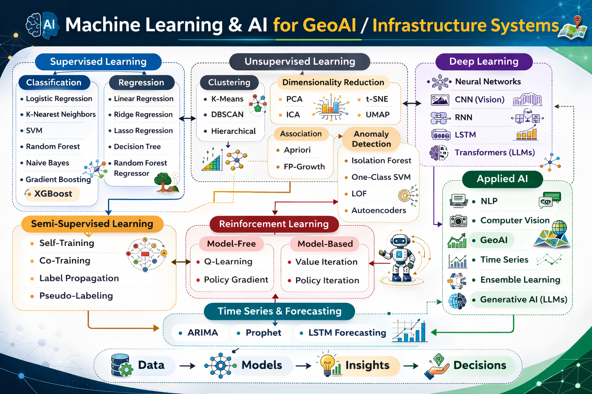

# Big Data & Machine Learning Projects

This folder contains advanced projects demonstrating:

- Distributed processing (Spark, Hive, HDFS)  
- Large-scale NLP  
- Cybersecurity intrusion detection  
- Streaming log analytics  
- Geospatial clustering and market analysis  

---

## Contents

| Folder | Project | Summary |
|--------|---------|---------|
| `1_ML_on_BigData_Tasks1a_1c/` | Word2Vec, TF-IDF, clustering | NLP & representation learning |
| `2_UNSW_NB15_Intrusion_Detection/` | Hive + Spark ML | Cybersecurity analytics |
| `3_LanguageModel_Discounting_Task2/` | MLE/GT/AD estimators | Statistical language modeling |
| `4_Streaming_Analytics_NASA/` | Spark Structured Streaming | Live log analytics |
| `5_Toronto_Location_Intelligence/` | Foursquare API + KMeans | Location intelligence |

Each folder contains:

- `README.md`  
- Notebook(s)  
- Figures  
- Template or synthetic dataset  
- Scripts (Python / PySpark)  

---

## Skills Demonstrated

- Distributed NLP modeling  
- Feature engineering at scale  
- Model evaluation (AUC, F1, confusion matrix)  
- Real-time log processing  
- Geospatial cluster analytics  

These projects are ideal for demonstrating competencies in:

- **Data Engineering**  
- **Machine Learning**  
- **Cybersecurity Analytics**  
- **Geospatial Data Science**  
- **Cloud-based Big Data Processing**

---

## Machine Learning & AI Taxonomy (GeoAI Focus)

```mermaid
graph TD

A[Machine Learning & AI for GeoAI / Infrastructure System]

A --> B[Supervised Learning]
B --> B1[Classification]
B --> B2[Regression]

B1 --> LR[Logistic Regression]
B1 --> KNN[K-Nearest Neighbors]
B1 --> SVM[Support Vector Machine]
B1 --> RF[Random Forest]
B1 --> NB[Naive Bayes]
B1 --> GB[Gradient Boosting]
B1 --> XGB[XGBoost]

B2 --> LIN[Linear Regression]
B2 --> RIDGE[Ridge Regression]
B2 --> LASSO[Lasso Regression]
B2 --> DTR[Decision Tree]
B2 --> RFR[Random Forest Regressor]

A --> C[Unsupervised Learning]

C --> C1[Clustering]
C1 --> KM[K-Means]
C1 --> DB[DBSCAN]
C1 --> HC[Hierarchical]

C --> C2[Dimensionality Reduction]
C2 --> PCA[PCA]
C2 --> ICA[ICA]
C2 --> TSNE[t-SNE]
C2 --> UMAP[UMAP]

C --> C3[Association]
C3 --> APR[Apriori]
C3 --> FP[FP-Growth]

C --> C4[Anomaly Detection]
C4 --> IF[Isolation Forest]
C4 --> OCSVM[One-Class SVM]
C4 --> LOF[LOF]
C4 --> AE[Autoencoders]

A --> D[Semi-Supervised]
D --> ST[Self Training]
D --> CT[Co Training]
D --> LP[Label Propagation]

A --> E[Reinforcement Learning]
E --> E1[Model-Free]
E1 --> QL[Q-Learning]
E1 --> PG[Policy Gradient]

E --> E2[Model-Based]
E2 --> VI[Value Iteration]
E2 --> PI[Policy Iteration]

A --> F[Deep Learning]
F --> NN[Neural Networks]
F --> CNN[CNN]
F --> RNN[RNN]
F --> LSTM[LSTM]
F --> TR[Transformers]

A --> G[Applied AI]
G --> NLP[NLP]
G --> CV[Computer Vision]
G --> GEO[GeoAI]
G --> ENS[Ensemble Learning]
G --> GENAI[Generative AI / LLMs]

A --> H[Time Series & Forecasting]
H --> ARIMA[ARIMA]
H --> PROPHET[Prophet]
H --> LSTM_TS[LSTM Forecasting]
```

