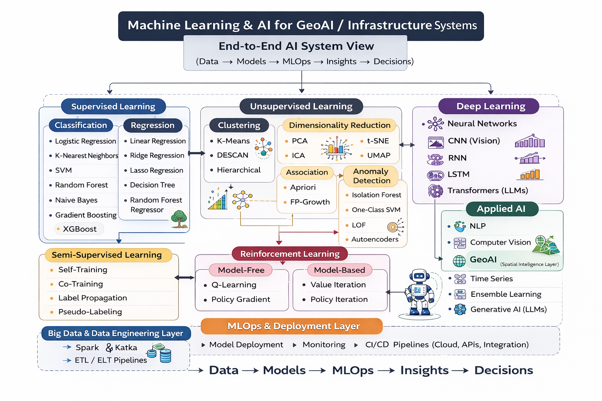

# 📊🧮 Big Data & Machine Learning Projects

> Turning large-scale data into intelligent systems for real-world decision-making.

---

---

## Introduction

This portfolio presents **end-to-end AI systems** built on Big Data infrastructure, integrating machine learning, GeoAI, and real-time analytics to solve real-world challenges.

Applications include:

- Public health surveillance and outbreak analytics  
- Cybersecurity threat detection and anomaly detection  
- Infrastructure and geospatial intelligence systems  
- Streaming and real-time data processing  

Each project demonstrates how **data → models → MLOps → insights → decisions** are connected in scalable, production-oriented workflows.

---

## Related Flagship Project

[Privacy-Preserving GeoAI Health Surveillance System](https://github.com/Jedidiah82/GeoAI-Health-Surveillance-System)

See the [Public Health GeoAI section](../2_PublicHealth_GeoAI) for the dissertation context, spatial epidemiology applications, and public-health decision-support focus.

---

## End-to-End AI System Architecture

This diagram illustrates how machine learning techniques integrate into real-world systems across GeoAI, infrastructure, and public health analytics.
It reflects a systems-oriented approach — connecting models, data pipelines, and decision-making workflows.

> Designed by Godwin Etim Akpan — illustrating a systems-level integration of Big Data, Machine Learning, GeoAI, and MLOps for real-world decision intelligence.

---

## Projects Portfolio

| Folder | Project | Summary |
|--------|---------|---------|
| `1_ML_on_BigData_Tasks1a_1c/` | Word2Vec, TF-IDF, clustering | NLP & representation learning |
| `2_UNSW_NB15_Intrusion_Detection/` | Hive + Spark ML | Cybersecurity analytics |
| `3_LanguageModel_Discounting_Task2/` | MLE/GT/AD estimators | Statistical language modeling |
| `4_Streaming_Analytics_NASA/` | Spark Structured Streaming | Live log analytics |
| `5_Toronto_Location_Intelligence/` | Foursquare API + KMeans | Location intelligence |

> Each project includes code, datasets (or templates), visualizations, and reproducible workflows.

---

## Technical Capabilities

- **Big Data Engineering:** Spark, Hive, HDFS, ETL/ELT pipelines  
- **Machine Learning:** Classification, clustering, anomaly detection, model evaluation (AUC, F1, confusion matrix)  
- **Streaming Analytics:** Real-time processing with Spark Structured Streaming  
- **GeoAI & Spatial Analytics:** Clustering, location intelligence, geospatial modeling  
- **NLP & Representation Learning:** TF-IDF, Word2Vec, statistical language modeling  
- **Cybersecurity Analytics:** Intrusion detection using UNSW-NB15 dataset  
- **MLOps & System Thinking:** Model deployment concepts, pipelines, monitoring awareness  

---

## System Flow (AI + Big Data + MLOps Integration)

The expanded diagrams below provide a deeper breakdown of algorithms, relationships, and learning paradigms across AI systems.

```mermaid
flowchart TB

%% =========================
%% TITLE / SYSTEM VIEW
%% =========================
A[Machine Learning & AI for GeoAI / Infrastructure Systems]
A --> A1[End-to-End AI System View]
A1 --> FLOW[Data → Models → MLOps → Insights → Decisions]

%% =========================
%% DATA LAYER (WITH BIG DATA)
%% =========================
D[Data Layer<br/>Batch • Streaming • Big Data Systems]
D --> D1[APIs]
D --> D2[Databases]
D --> D3[Logs / Files]
D --> D4[Geospatial Data]

subgraph BIGDATA["Big Data & Data Engineering Layer"]
BD1[Spark]
BD2[Hadoop]
BD3[Kafka]
BD4[ETL / ELT Pipelines]
end

D --> BIGDATA

%% =========================
%% MACHINE LEARNING CORE
%% =========================
A --> B[Supervised Learning]
B --> B1[Classification]
B --> B2[Regression]

B1 --> LR[Logistic Regression]
B1 --> KNN[KNN]
B1 --> SVM[SVM]
B1 --> RF[Random Forest]
B1 --> NB[Naive Bayes]
B1 --> XGB[XGBoost]

B2 --> LIN[Linear Regression]
B2 --> RIDGE[Ridge]
B2 --> LASSO[Lasso]
B2 --> DT[Decision Tree]
B2 --> RFR[Random Forest Regressor]

%% =========================
%% UNSUPERVISED
%% =========================
A --> C[Unsupervised Learning]

C --> C1[Clustering]
C1 --> KM[K-Means]
C1 --> DB[DBSCAN]
C1 --> HC[Hierarchical]

C --> C2[Dimensionality Reduction]
C2 --> PCA[PCA]
C2 --> ICA[ICA]
C2 --> TSNE[t-SNE]
C2 --> UMAP[UMAP]

C --> C3[Association]
C3 --> APR[Apriori]
C3 --> FP[FP-Growth]

C --> C4[Anomaly Detection]
C4 --> IF[Isolation Forest]
C4 --> OCSVM[One-Class SVM]
C4 --> LOF[LOF]
C4 --> AE[Autoencoders]

%% =========================
%% SEMI SUPERVISED
%% =========================
A --> D2S[Semi-Supervised Learning]
D2S --> ST[Self Training]
D2S --> CT[Co-Training]
D2S --> LP[Label Propagation]

%% =========================
%% REINFORCEMENT
%% =========================
A --> E[Reinforcement Learning]
E --> E1[Model-Free]
E1 --> QL[Q-Learning]
E1 --> PG[Policy Gradient]

E --> E2[Model-Based]
E2 --> VI[Value Iteration]
E2 --> PI[Policy Iteration]

%% =========================
%% DEEP LEARNING
%% =========================
A --> F[Deep Learning]
F --> NN[Neural Networks]
F --> CNN[CNN]
F --> RNN[RNN]
F --> LSTM[LSTM]
F --> TR[Transformers / LLMs]

%% =========================
%% TIME SERIES
%% =========================
A --> TS[Time Series & Forecasting]
TS --> ARIMA[ARIMA]
TS --> PROPHET[Prophet]
TS --> LSTMTS[LSTM Forecasting]

%% =========================
%% APPLIED AI (WITH GEOAI EMPHASIS)
%% =========================
A --> G[Applied AI]

G --> NLP[NLP]
G --> CV[Computer Vision]
G --> GEO["🌍 GeoAI (Spatial Intelligence)"]
G --> ENS[Ensemble Learning]
G --> GEN[Generative AI]

%% =========================
%% MLOPS / DEPLOYMENT LAYER
%% =========================
M[MLOps & Deployment Layer]
M --> M1[Model Deployment]
M --> M2[Monitoring & Logging]
M --> M3[CI/CD Pipelines]
M --> M4[APIs & Integration]
M --> M5[Cloud Infrastructure]

%% =========================
%% FINAL FLOW CONNECTIONS
%% =========================
D --> A
A --> M
M --> OUT[Insights & Decision Systems]
```

---

## Key Strength

This portfolio reflects a **systems-level approach to AI**, combining:

- Scalable data engineering and distributed processing  
- Machine learning and statistical modeling  
- Geospatial intelligence (GeoAI) and spatial analytics  
- Time-series forecasting and anomaly detection  
- MLOps principles for deployment and monitoring awareness  

The focus is not just on building models, but on designing **integrated, end-to-end AI systems** that support real-world decision-making across public health, infrastructure, and cybersecurity domains.
