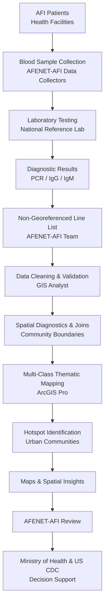
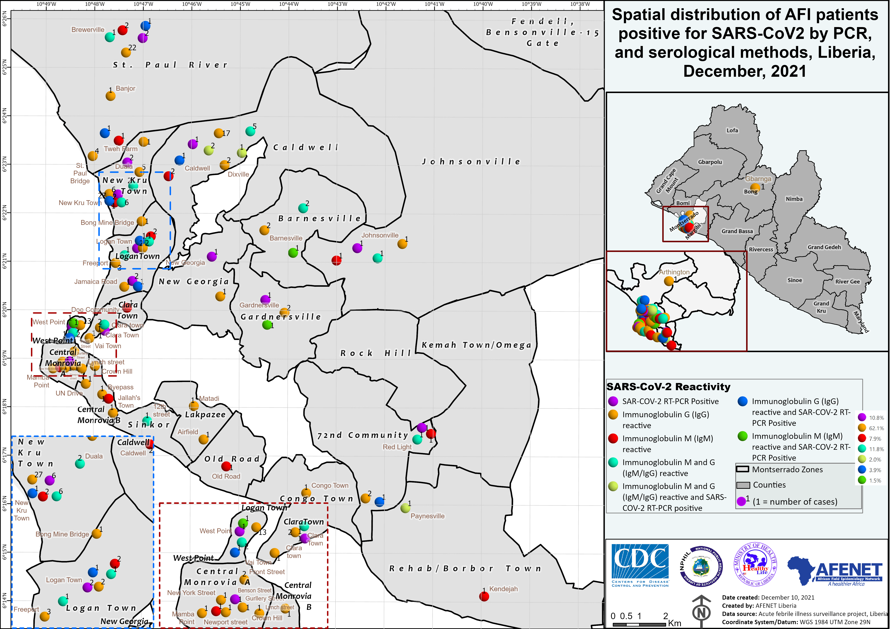

<<<<<<< HEAD
# 🌡 Spatial Distribution of AFI Patients Positive for SARS-CoV-2 — Greater Monrovia, Liberia (Dec 2021)

**COVID-19 Surveillance Mapping | Acute Febrile Illness (AFI) Study**

**Role:** GIS Analyst  
**Tools:** ArcGIS Pro  
**Date:** December 2021  
**Clients/Partners:** AFENET Liberia, NPHIL, Ministry of Health, U.S. CDC  

---
=======
# 🌡 Spatial Distribution of Acute Febrile Illness (AFI) Patients Positive for SARS-CoV-2 — Monrovia, Liberia
>>>>>>> d0bb279e2fea950be49b8044e151d25b69afe41b

## Overview

Produced a high-resolution epidemiological map visualizing the spatial distribution of **acute febrile illness (AFI) patients who tested positive for SARS-CoV-2** across Greater Monrovia, Liberia.

The map supported **epidemiological interpretation of COVID-19 circulation in densely populated urban communities**, informing targeted surveillance, testing, and public-health interventions during a critical phase of Liberia’s pandemic response.

This work enabled rapid translation of laboratory surveillance data into actionable, location-specific public-health intelligence.

---

## Surveillance & GIS Workflow Architecture

### Workflow Description

- **Sample Collection:** Blood samples were collected from AFI patients by **AFENET-AFI field data collectors** across health facilities and communities in Greater Monrovia.
- **Laboratory Processing:** Samples were processed by the **AFENET-AFI laboratory team** at Liberia’s **National Reference Laboratory**, generating PCR and serological results.
- **Data Handoff:** A **non-georeferenced and de-identified line list of diagnostic results** was securely shared with the GIS analyst.
- **GIS Processing:** The GIS analyst:
  - Cleaned and validated laboratory and location data
  - Performed spatial joins with community and administrative boundaries
  - Conducted spatial diagnostics and hotspot analysis
  - Designed multi-class thematic symbology representing diagnostic combinations
- **Dissemination:** Final GIS products and spatial insights were reviewed by **AFENET-AFI** and shared with the **Ministry of Health** and **U.S. CDC** to support public-health decision-making.

---

### Map Output

*Figure 1. Spatial distribution of AFI patients positive for SARS-CoV-2 by PCR and serological methods across Greater Monrovia, Liberia (December 2021).*
> The map highlights diagnostic diversity, clustering, and transmission hotspots used to inform COVID-19 surveillance and response planning.

---

## Analytical Approach & Methodology

### Multi-Class Diagnostic Visualization
- Implemented multi-variable thematic symbology to represent **seven diagnostic result combinations**, including:
  - RT-PCR positive
  - IgG reactive
  - IgM reactive
  - Combined IgM/IgG reactivity
  - PCR + serology combinations
- Enabled simultaneous interpretation of **active infection and prior exposure patterns**

### Spatial Density & Hotspot Identification
- Labeled point symbols by patient count to highlight **case clustering**
- Revealed transmission hotspots in high-density communities such as:
  - West Point
  - Clara Town
  - Logan Town
  - Central Monrovia

### Spatial Context & Cartographic Design
- Integrated inset maps of Liberia and Greater Monrovia for national and urban context
- Overlaid administrative boundaries and community zones
- Designed a comprehensive legend and map elements (scale bar, north arrow) for analytical clarity

---

## GIS Tasks Performed

- Cleaned, validated, and geocoded patient location and laboratory result data
- Performed spatial joins to associate cases with community-level administrative units
- Designed multi-class symbology to encode diagnostic complexity
- Produced publication-quality maps for epidemiological reporting and decision support

---

## Impact

This GIS product enabled national and international public-health stakeholders to:

- Identify spatial patterns of SARS-CoV-2 exposure in **high-density urban communities**
- Support **targeted surveillance, testing, and outreach prioritization**
- Inform **risk communication, intervention planning, and situational awareness**
- Contribute to coordinated response efforts between **AFENET, MoH, and U.S. CDC**
