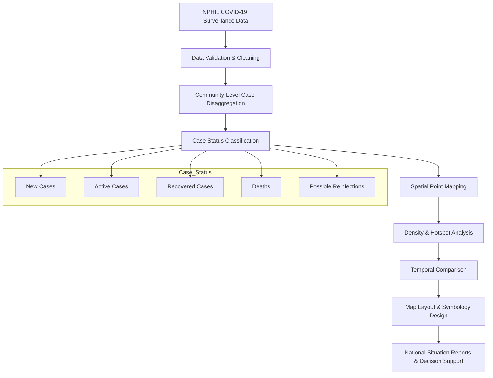
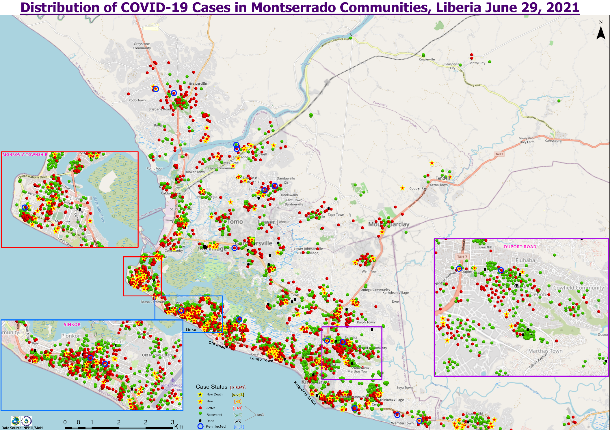
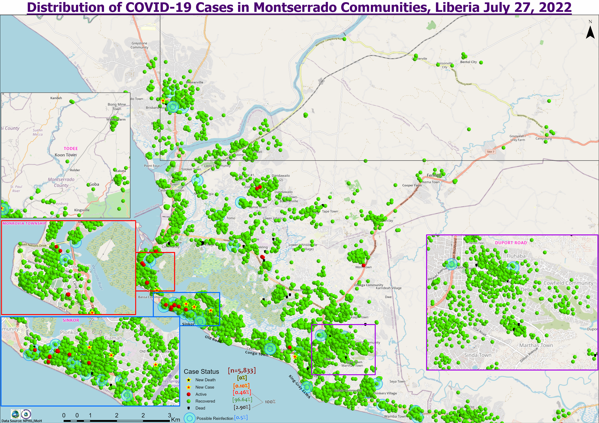
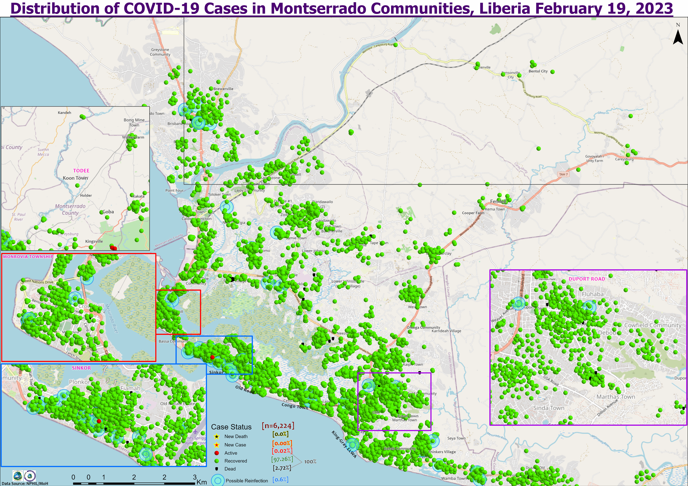
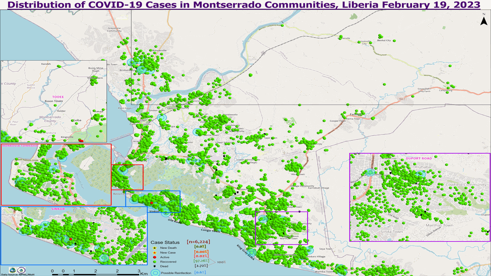
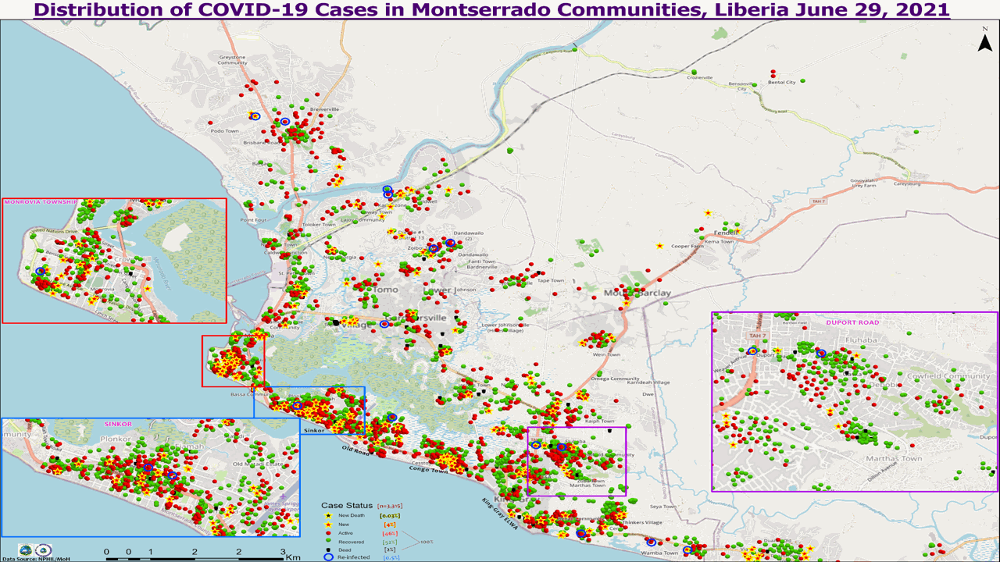
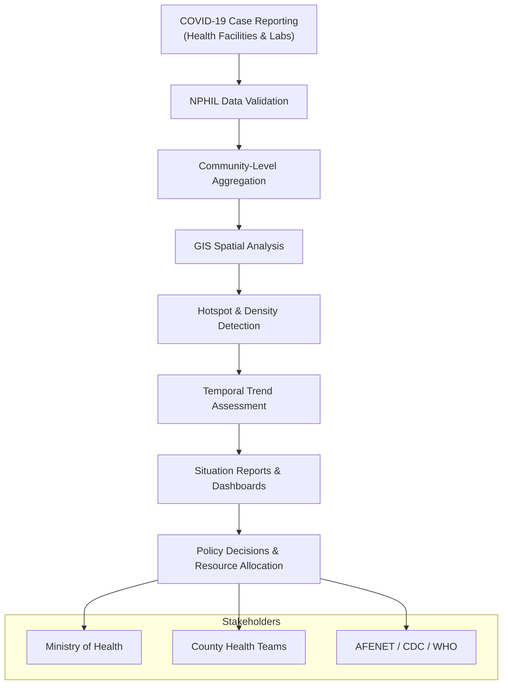

# 🌆 COVID-19 Temporal Hotspot Change — Montserrado County, Liberia (2021–2023)

> A spatiotemporal GIS analysis of COVID-19 case dynamics across Montserrado County in Liberia, supporting national COVID-19 surveillance, hotspot detection, and evidence-based public health response planning.

**Client / Partners:** Liberia Ministry of Health (MoH), National Public Health Institute of Liberia (NPHIL); AFENET, CDC, WHO   
**Role:** GIS & Data Specialist — COVID-19 Surveillance & Spatial Analytics Team  
**Tools:** ArcGIS Pro  
**Primary Data Source:** National Public Health Institute of Liberia (NPHIL)

---

## Overview

This project presents a **temporal GIS analysis of COVID-19 case distributions** across communities in **Montserrado County, Liberia**, covering three critical epidemiological periods:

- **June 29, 2021** — Peak outbreak phase  
- **July 27, 2022** — Post-wave recovery phase  
- **February 19, 2023** — Stabilization phase  

A three-map time series was developed to visualize **changes in case status, spatial clustering, and hotspot intensity** over time. The maps supported **national surveillance reporting, situational awareness, and targeted public-health response planning**.

---

## Objectives

- Enhance situational awareness during and after major COVID-19 waves  
- Track spatial and temporal shifts in case density and clustering  
- Support public health communication with clear, community-level visualizations  
- Inform resource allocation and preparedness planning  

---

## Data & Case Classification

COVID-19 case records were **disaggregated at the community level** and symbolized by epidemiological status:

- New cases  
- Active cases  
- Recovered cases  
- Deaths  
- Possible reinfections  

All datasets were **validated and standardized** according to **NPHIL surveillance protocols** prior to mapping.

---

## Methodology

- Community-level point mapping of confirmed case records  
- Density-based visualization to identify clustering and hotspots  
- Time-series comparison across three epidemiological snapshots  
- Zoom-in inset panels for high-density urban areas  
- Custom symbology for rapid interpretation by non-technical stakeholders  

---

## Analytical Workflow

---

## Results & Figures

### Figure 1 — COVID-19 Case Distribution (June 29, 2021)

**Interpretation:**  
This period reflects an **intense outbreak phase**, characterized by high concentrations of **active cases, reinfections, and deaths**, particularly in densely populated communities such as **Sinkor, Paynesville, and Monrovia Township**. Multiple hotspot clusters indicate widespread community transmission.

---

### Figure 2 — COVID-19 Case Distribution (July 27, 2022)

**Interpretation:**  
A clear **shift toward recovered cases** is observed, with substantially fewer active cases and reduced hotspot intensity. This pattern reflects the **impact of public-health interventions, vaccination efforts, and improved case management**.

---

### Figure 3 — COVID-19 Case Distribution (February 19, 2023)

**Interpretation:**  
By early 2023, **new and active cases are minimal**, with recovered cases dominating the spatial pattern. Hotspot density is significantly reduced, indicating **epidemic stabilization and improved control** across Montserrado County.

---

## Temporal Progression of COVID-19 Hotspots (2021–2023)

**Figure:** Animated time-series visualization of COVID-19 case density across Montserrado County, Liberia,
illustrating the transition from peak transmission (June 2021) to post-wave recovery (July 2022) and
epidemic stabilization (February 2023).

> ▶ Click the image to play the animation.

## Temporal Progression of COVID-19 Hotspots (2021–2023)

**Figure:** Animated time-series visualization of COVID-19 case density across Montserrado County, Liberia, showing the transition from peak transmission (June 2021) to post-wave recovery (July 2022) and epidemic stabilization (February 2023).

**Description:**  
This animation provides a rapid, intuitive view of how COVID-19 hotspots **expanded, contracted, and stabilized over time**, supporting situational awareness and retrospective assessment of intervention effectiveness.

**Key patterns illustrated:**
- Rapid expansion of high-density hotspots during the 2021 outbreak peak  
- Progressive reduction in hotspot intensity following public-health interventions  
- Sparse clustering and spatial stabilization by early 2023     

---

## Map Index & Legend Interpretation

The maps use a **standardized symbology scheme** designed for clarity and rapid interpretation by public health decision-makers.

### Case Status Symbology
| Symbol / Color | Interpretation |
|---------------|---------------|
| 🟢 Green Dot | Recovered case |
| 🔴 Red Dot | Active case |
| ⭐ Yellow Star | New case |
| ⚫ Black Dot | Death |
| 🔵 Blue Ring | Possible reinfection |

### Spatial Design Elements
- **Point Mapping:** Individual confirmed case locations  
- **Density Clustering:** Visual concentration of cases to identify hotspots  
- **Inset Panels:** Zoomed views of high-density urban corridors (e.g., Sinkor, Paynesville, Monrovia Township)  
- **Consistent Color Encoding:** Ensures comparability across time periods  

This design supports both **technical epidemiological analysis** and **non-technical policy briefings**.

---

## Key Findings

- **2021:** Widespread transmission with multiple high-density hotspots in urban corridors  
- **2022:** Transition phase marked by declining active cases and expanding recovery  
- **2023:** Sustained reduction in transmission with sparse clustering and minimal severe outcomes  

The spatial trends align with **national epidemiological reports and intervention timelines**.

---

## Policy Implications

The temporal and spatial patterns observed in this analysis provide actionable insights for
public health policy and preparedness planning.

### Key Policy-Relevant Insights
- **Targeted Intervention:** Persistent urban hotspots highlight the need for focused interventions in densely populated corridors.
- **Resource Allocation:** Declining hotspot intensity supports evidence-based scaling down of emergency response resources.
- **Surveillance Strategy:** Time-series GIS analysis enables early detection of resurgence and reinfection clusters.
- **Preparedness Planning:** Historical hotspot patterns inform future outbreak readiness and rapid response zoning.

### Strategic Value
By integrating GIS-driven temporal analysis into routine surveillance, health authorities can:
- Improve outbreak response efficiency  
- Enhance data-driven decision-making  
- Strengthen epidemic preparedness frameworks  

This approach aligns with **WHO and CDC recommendations** for spatially informed disease surveillance.

### Decision-Support Workflow

---

## Impact

- Maps incorporated into national situation reports and partner briefings  
- Supported targeted intervention planning in high-risk communities  
- Enabled temporal comparison for epidemic preparedness and future response design  
- Strengthened GIS-driven decision-making within national surveillance systems  

---

## Outputs

- High-resolution static maps for reporting and print  
- Time-series comparison visuals for trend analysis  
- Community-level hotspot interpretation for operational planning  

---

## Scope & Limitations

- Analysis limited to reported and validated cases  
- Spatial resolution constrained by available community boundary definitions  
- Focused on descriptive spatial analysis; transmission dynamics not modeled  

---

## Author

**Godwin Etim Akpan**  
GIS & Data Specialist — Public Health Surveillance  
Big Data • GIS • Epidemiology • Spatial Analytics
