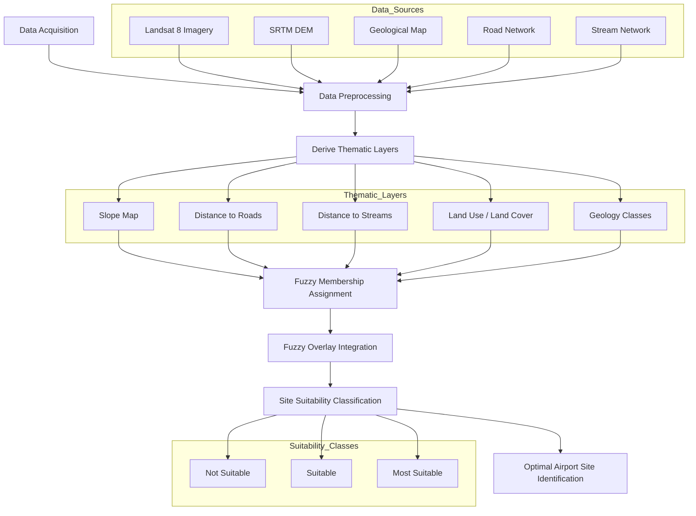

# 🛩️ Airport Site Suitability Mapping — Obafemi Awolowo University (OAU), Nigeria

**Institution:** Federal University of Technology Akure (FUTA) / ARCSSTE-E  
**Location:** Ile-Ife, Osun State, Nigeria  
**Year:** 2016  
**Role:** Project Lead  
**Tools:** ArcGIS Desktop, Landsat 8, SRTM DEM  

---

## Overview

This project presents a **GIS-based multi-criteria site suitability analysis** to identify the most optimal location for a **mini-airport** within the Obafemi Awolowo University (OAU) campus and surrounding areas.

Using **fuzzy logic modeling and spatial overlay techniques**, multiple environmental and infrastructural factors were integrated to support **sustainable, cost-effective infrastructure planning**.

---

## Objectives

- Identify airstrip locations with minimal environmental and engineering constraints  
- Reduce construction and maintenance costs by targeting stable, accessible terrain  
- Support data-driven campus infrastructure decision-making  

---

## Data & Criteria

The analysis integrated the following spatial datasets:

### Environmental & Physical Factors
- **Elevation & Slope:** Derived from SRTM DEM to prioritize flat terrain  
- **Hydrology:** Stream networks used to avoid flood-prone zones  
- **Geology:** Identification of stable substrates (e.g., granite, gneiss)  

### Infrastructure & Land Use Factors
- **Road Accessibility:** Proximity to existing transportation networks  
- **Land Use / Land Cover:** Derived from supervised Landsat 8 classification to minimize disruption to built-up areas  

---

## Methodology

- Acquisition and preprocessing of Landsat 8 imagery and SRTM DEM  
- Digitization of geology, road, and stream networks  
- Supervised land use / land cover classification  
- Assignment of fuzzy membership functions to each criterion  
- Spatial integration using **fuzzy overlay modeling**  
- Generation of a composite **site suitability surface**  

---

## Analytical Workflow

---

## Results & Outputs

### Site Suitability Classification
- **Most Suitable**
- **Suitable**
- **Not Suitable**

The final suitability map highlights an optimal airport site near:

> **Latitude:** 7.53°N  
> **Longitude:** 4.53°E  

This location balances **terrain stability, accessibility, hydrological safety, and land-use compatibility**.

---

## Impact

- Provided a scientifically grounded basis for campus infrastructure planning  
- Demonstrated the effectiveness of fuzzy logic in spatial decision-making  
- Established a reusable framework for future environmental and infrastructure assessments  

---

## Limitations & Future Work

- Wind patterns and airspace constraints were not included  
- Socio-economic and noise-impact assessments could further refine suitability  
- Model can be extended using AHP or machine-learning-based weighting  

---

## Author

**Godwin Etim Akpan**  
GIS & Spatial Data Specialist  
Remote Sensing • Spatial Modeling • Infrastructure Planning
