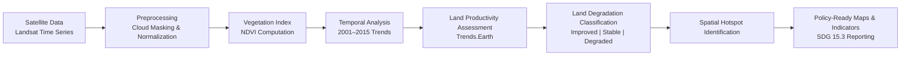
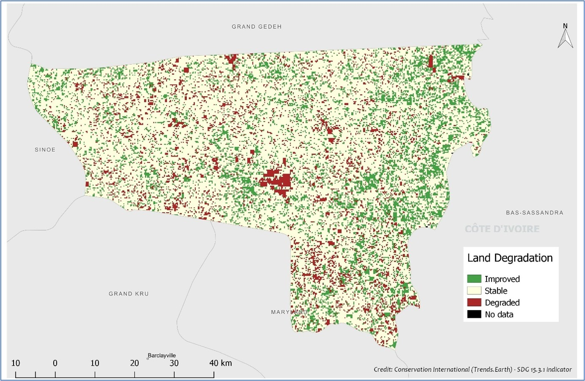
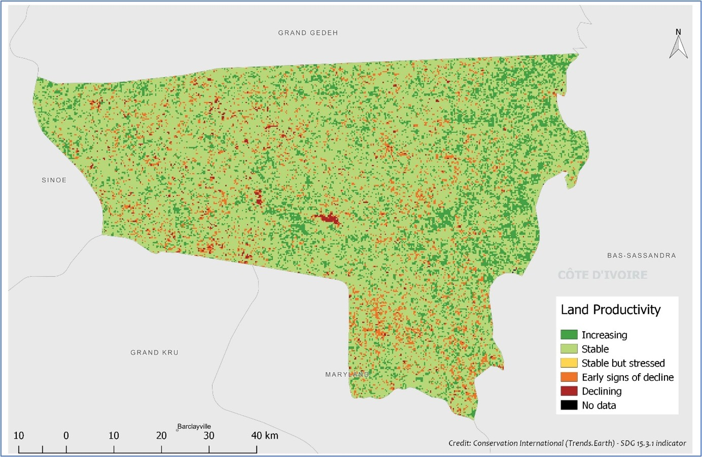

# 🌿 Land Degradation & Productivity Assessment — River Gee County, Liberia (2001–2015)

**SDG 15.3 Pilot Project | Independent GIS Research (2019)**  
**Tools:** Trends.Earth, ArcGIS, Remote Sensing  

---

## Overview
This project presents a **remote sensing–driven assessment of land degradation and land productivity trends** in River Gee County, Liberia, supporting national implementation of **SDG 15.3 (Land Degradation Neutrality)**.

Using Earth observation data and the **Trends.Earth** analytical framework, spatial and temporal patterns of degradation were quantified between **2001 and 2015** in one of Liberia’s least-documented regions.

---

## Analytical Workflow

*Figure: End-to-end analytical workflow illustrating how satellite observations were transformed into SDG 15.3–aligned land degradation indicators for policy and decision support.*

---

## Key Outputs

### Land Degradation Status

*Classification of land as Improved, Stable, or Degraded based on SDG 15.3 indicators.*

---

### Land Productivity Trends

*Spatial patterns of increasing, stable, and declining land productivity.*

---

## Analytical Workflow
- Satellite data preprocessing (cloud masking, reflectance normalization)
- NDVI time-series analysis
- Land productivity trajectory assessment
- Change detection (2001 → 2015)
- SDG 15.3 indicator computation using Trends.Earth
- Cartographic synthesis for policy communication

---

## Impact
- Demonstrated the feasibility of **sub-national SDG 15.3 monitoring** using open geospatial tools
- Identified **degradation hotspots** to support conservation and land management planning
- Findings were presented to **local policymakers**, including the Senator of River Gee County
- Contributed to policy dialogue with **Conservation International** and partners

---

## Limitations & Future Work
- Incorporate higher-resolution Sentinel-2 imagery
- Integrate rainfall, soil, and socio-economic covariates
- Extend analysis to national-scale SDG reporting

---

## Author
**Godwin Etim Akpan**  
GIS & Remote Sensing Specialist  
Environmental Analytics • SDG Monitoring • Spatial Decision Support
