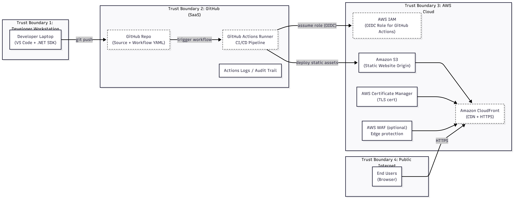

# Applied Cryptography Using AWS Services & Secure Communication Protocols

> **Portfolio project demonstrating applied cryptography, secure communication, and key management using AWS cloud services instead of manual cryptographic implementations.**


---

## Project Overview

This project is a **modern, cloud-aligned replacement for legacy cryptography labs**, demonstrating how cryptographic principles are applied in real-world cloud environments using **AWS-managed services**. 

Rather than manually implementing DES, RSA, or Diffie-Hellman in C, this project focuses on:

- Secure authentication
- Encrypted communication
- Key exchange mechanisms
- Key management at scale
- Cloud-native security best practices

All activities were performed using **AWS CLI on Windows PowerShell**.

---

## Security Architecture & Trust Boundaries



This architecture illustrates how modern cloud platforms apply cryptographic principles 
— authentication, encryption, and key management — using managed services rather than 
manual algorithm implementation.

The design enforces clear trust boundaries between the developer workstation, GitHub 
(SaaS CI/CD), AWS cloud services, and the public internet, while eliminating long-lived 
credentials through OIDC-based federated identity.

The following mapping demonstrates how the implemented architecture aligns with
the NIST Cybersecurity Framework (CSF) functions under a shared responsibility model.

## NIST CSF & Shared Responsibility Mapping
This project demonstrates alignment with the NIST Cybersecurity Framework (CSF) within a
shared responsibility cloud model.

### Identify (ID)
- Source code, CI/CD workflows, and deployment configurations are version-controlled and
  governed in GitHub.
- AWS accounts, IAM roles, and cloud resources define asset ownership and security scope.

### Protect (PR)
- Least-privilege access enforced using IAM roles and OIDC-based federated authentication
  for GitHub Actions.
- No long-lived access keys are stored; authentication relies on short-lived tokens.
- TLS is enforced for all external communication via AWS-managed certificates.
- - Infrastructure security, patching, platform hardening, and cryptographic key
  protection are handled by AWS-managed services.

### Detect (DE)
- GitHub Actions logs provide real-time visibility into build and deployment activity.
- AWS service logs and deployment history enable auditing and operational awareness.

### Respond (RS)
- CI/CD failures and permission issues are identified through pipeline execution results.
- Misconfigurations are corrected through controlled workflow and IAM policy updates.
- All changes are traceable via Git history and audit logs.

### Recover (RC)
- The application can be redeployed at any time using a repeatable CI/CD pipeline.
- No stateful infrastructure recovery is required due to serverless, managed services.
- Cryptographic keys and certificates are managed and rotated by AWS services.

### Shared Responsibility Statement
Under the cloud shared responsibility model, AWS secures the underlying infrastructure,
network, and managed services, while the user is responsible for source code, CI/CD
configuration, identity governance, and access control.

---

## Project Aim

To apply modern cryptographic principles—**authentication, key exchange, encryption, and key management**—using AWS cloud services in a secure and industry-aligned manner.

---

## Objectives

- Apply asymmetric cryptography using SSH key-based authentication  
- Observe Diffie-Hellman key exchange via TLS and SSH  
- Understand symmetric encryption used by AWS services  
- Practice secure IAM key management  
- Demonstrate encryption in transit and at rest in a cloud environment  

---

## Tools & Environment

- AWS CLI v2 (Windows PowerShell)
- Amazon EC2 (Amazon Linux 2023)
- AWS Identity and Access Management (IAM)
- Secure Shell (SSH)
- Amazon CloudWatch
- *(Optional Extension)* AWS Key Management Service (KMS), Amazon S3

---

## Implementation Summary

### Environment Setup
- Configured AWS CLI using IAM access keys
- Secured root account with MFA
- Used IAM user for all operational tasks

### Secure Compute Provisioning
- Created EC2 SSH key pair (asymmetric cryptography)
- Launched EC2 instance using AWS CLI
- Connected securely via SSH using key-based authentication

### Encrypted Communication
- Verified TLS-encrypted AWS API communication
- Observed encrypted SSH sessions between local system and EC2

### Monitoring & Governance
- Enabled Amazon CloudWatch metrics
- Tested least-privilege IAM policy enforcement
- Validated permission boundaries through controlled access failures

### Cost Control
- Explicitly terminated EC2 resources after use
- Ensured no ongoing cloud charges

---

## Results

- Secure EC2 provisioning completed using AWS-managed cryptography
- Encrypted communication achieved without manual cryptographic coding
- IAM security controls enforced successfully
- Monitoring and lifecycle management validated
- Encryption was validated without exposing keys or secrets at any stage

---

## Key Takeaways

- Modern cloud platforms abstract cryptography securely and at scale
- AMI selection and API access are region-specific
- Least-privilege IAM policies intentionally restrict administrative actions
- Encryption in transit and at rest is standard in cloud-native systems
- Explicit resource cleanup is essential for cost control

---

## Security Theory Appendix

### DES (Data Encryption Standard)
- Symmetric encryption algorithm
- 56-bit effective key length
- Vulnerable to brute-force attacks
- Deprecated and replaced by **AES-128 / AES-256**

### RSA Algorithm
- Asymmetric cryptographic algorithm
- Uses public/private key pairs
- Commonly used for authentication and key exchange

**AWS Usage**
- SSH key pairs
- TLS certificates

### Diffie-Hellman Key Exchange
- Secure method for exchanging encryption keys
- No shared secret transmitted
- Foundation of TLS and SSH
- Modern implementations use **ECDH**

### Why Cryptography Is Not Implemented Manually
- High risk of vulnerabilities
- Error-prone implementations
- Industry relies on vetted, audited libraries
- AWS provides secure, scalable cryptographic services

---

## Cryptography & Security Architecture

### TLS Flow (AWS CLI → AWS API)
```text
AWS CLI
  ↓
TLS Handshake (ECDH)
  ↓
Encrypted Session (AES)
  ↓
AWS API Endpoint
```

### SSH Authentication Flow
```text
Local Machine (Private Key)
  ↓
SSH Handshake (RSA / ECDSA)
  ↓
EC2 Instance (Public Key)
```

### AWS KMS Envelope Encryption
```text
Plaintext
  ↓
Data Key (AES)
  ↓
Encrypted by CMK (KMS)
  ↓
Encrypted Data Stored
```

## AWS KMS + Encrypted S3 
### Create Encrypted S3 Bucket
```powershell
aws s3 mb s3://my-secure-crypto-lab-bucket
```

### Enable KMS Encryption
```powershell
aws s3api put-bucket-encryption `
  --bucket my-secure-crypto-lab-bucket `
  --server-side-encryption-configuration '{
    "Rules":[{
      "ApplyServerSideEncryptionByDefault":{
        "SSEAlgorithm":"aws:kms"
      }
    }]
  }'
```

### Upload Encrypted Object
```powershell
aws s3 cp test.txt s3://my-secure-crypto-lab-bucket/
```
✔ Data encrypted at rest
✔ KMS-managed keys
✔ Enterprise-grade security controls


## Repository Structure

```text
applied-cryptography-aws/
├── README.md
├── diagrams/
│   ├── tls-flow.png
│   ├── ssh-auth-flow.png
│   └── kms-envelope-encryption.png
├── policies/
│   └── iam-least-privilege.json
├── scripts/
│   ├── create-ec2.ps1
│   ├── terminate-ec2.ps1
│   └── s3-kms-encryption.ps1
```


## Certification & Industry Alignment
- **CompTIA Security+** — Cryptography, TLS, IAM, encryption
- **CompTIA CySA+** — Least privilege, cloud security controls
- **AWS Security** — IAM, KMS, encrypted services, secure access


## Why This Project Matters

This project demonstrates how cryptography is **applied in real systems**, not just how algorithms work on paper.

While informed by academic lab objectives, the implementation **extends beyond the original lab instructions** to reflect how cryptography is used in **modern cloud security environments.**

It reflects how security professionals interact with:

- TLS-secured APIs
- SSH-based authentication
- IAM permission boundaries
- Managed key services (KMS)

Rather than implementing cryptographic algorithms manually, the project emphasizes **secure integration, trust boundaries, and key management using AWS-managed services**.**

This approach aligns directly with expectations for **cloud security, DevSecOps, and infrastructure security roles.**

## Scope & Limitations
- Not a production-ready deployment
- Single EC2 instance (no high availability)
- Default VPC used
- AdministratorAccess used temporarily for learning
- Designed for education and portfolio demonstration

## Reproducibility

This lab can be reproduced using AWS Free Tier resources.

High-level steps:
1. Configure AWS CLI with IAM credentials
2. Generate SSH key pair
3. Launch EC2 instance via AWS CLI
4. Connect securely via SSH
5. Validate TLS-secured AWS API communication
6. (Optional) Enable KMS-backed S3 encryption
7. Terminate all resources

## Final Notes
This project demonstrates **applied cloud cryptography**, emphasizing how modern platforms securely implement encryption, authentication, and key management in real-world environments.

It reflects industry best practices and provides a strong foundation for roles in **cloud security, cybersecurity, and DevSecOps**.
