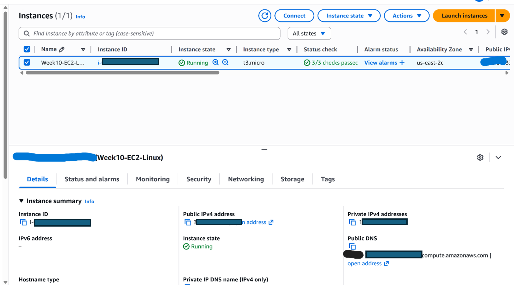
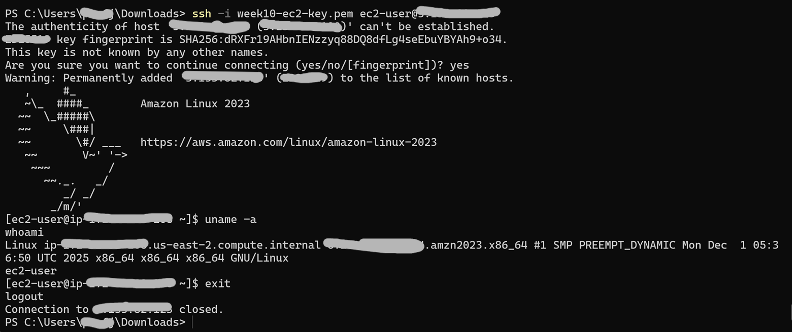
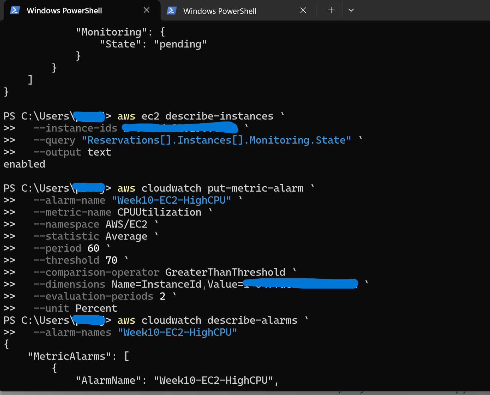
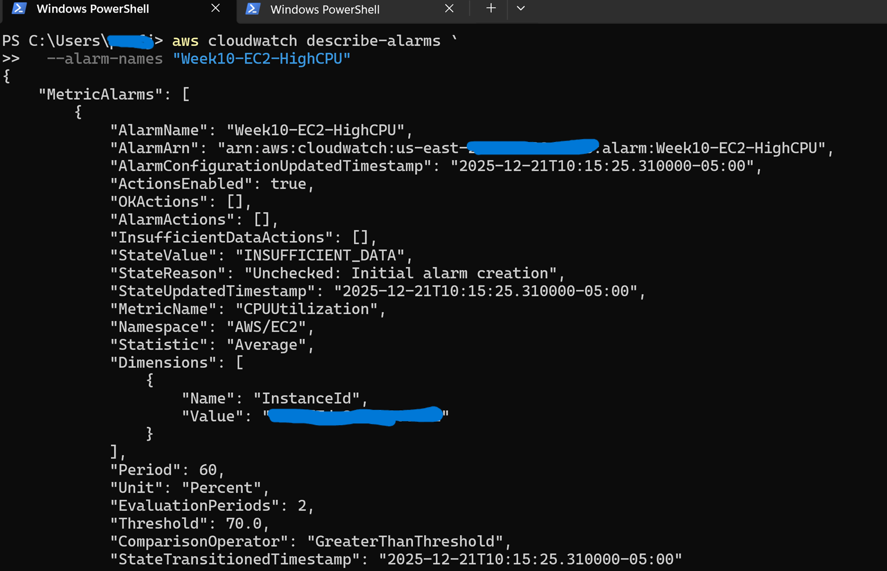
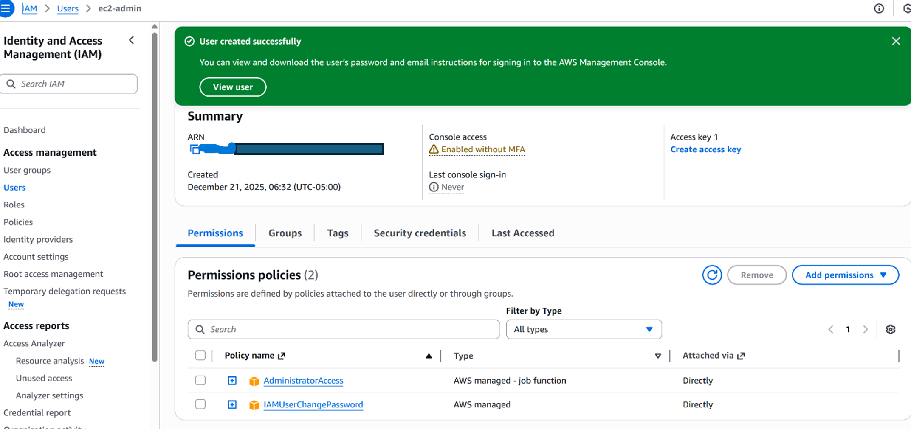

# ☁️ AWS EC2 Infrastructure Provisioning & Monitoring (CLI-Based)


**IAM • EC2 • SSH • CloudWatch • Cost Governance**

---

## Project Overview

This project demonstrates **end-to-end AWS EC2 infrastructure provisioning and monitoring using the AWS CLI**, with a focus on identity management, secure access, observability, and cost control.

Rather than relying on the AWS Management Console, all resources were **created, verified, monitored, and terminated using CLI-based workflows**, mirroring automation-first practices commonly used in cloud and security engineering roles.

The project emphasizes **practical cloud fundamentals**, including IAM permissions, key-based SSH access, EC2 lifecycle management, CloudWatch monitoring, and safe resource cleanup.

Detailed CLI commands and execution notes are documented in docs/command-reference.md.

---

## Project Focus

- Provision EC2 infrastructure using the AWS CLI  
- Configure and validate IAM permissions  
- Establish secure SSH access using key pairs  
- Monitor instance health and metrics via CloudWatch  
- Practice cost-aware resource lifecycle management  
- Understand AWS security boundaries through hands-on interaction  

---

## Tools & Environment

| Tool / Service | Purpose |
|---------------|--------|
| AWS CLI v2 | Infrastructure provisioning and management |
| Amazon EC2 | Compute resources |
| AWS IAM | Identity and access management |
| Amazon CloudWatch | Monitoring and metrics |
| Amazon Linux 2023 AMI | Instance operating system |
| SSH | Secure remote access |

---

## Conceptual Architecture

```text
IAM User
   ↓
AWS CLI (PowerShell)
   ↓
EC2 API
   ↓
EC2 Instance (Amazon Linux)
   ↓
SSH Access
   ↓
CloudWatch Metrics & Alarms
```

---

This architecture reflects a minimal but realistic AWS workflow, focusing on identity-driven access, compute provisioning, and observability.

---

## Design Decisions

Several deliberate design choices were made to keep the project realistic, cost-safe, and focused on core AWS fundamentals:

- **AWS CLI over Console**  
  Chosen to reflect automation-first and infrastructure-as-code workflows rather than manual configuration.

- **Single EC2 Instance**  
  Used to focus on IAM behavior, access control, and monitoring rather than scalability.

- **Default VPC**  
  Accepted to avoid unnecessary network complexity while reinforcing core EC2 concepts.

- **Temporary Broad Permissions**  
  Administrator-level access was used initially for learning, then restricted to observe least-privilege enforcement.

- **Explicit Resource Termination**  
  Practiced to reinforce cost governance and prevent unintended billing.

These decisions prioritize clarity, reproducibility, and operational discipline.

---

## Implementation Overview

### IAM Configuration

- Created and authenticated an IAM user via the AWS CLI  
- Attached and tested IAM policies  
- Verified caller identity using AWS STS commands  

### EC2 Provisioning

- - Selected a region-specific Amazon Linux 2023 AMI (modern, security-focused default)
- Created and associated an SSH key pair  
- Launched an EC2 instance using CLI commands  
- Verified instance state and metadata  



_EC2 launch confirmation showing successful initialization and security group creation._

### Secure Access (SSH)

- Connected to the EC2 instance using key-based SSH  
- Validated security group rules and connectivity  
- Confirmed successful remote access  



_Successful SSH connection using key-based authentication, followed by Linux system verification on Amazon Linux 2023._

### Monitoring & Observability

Instance-level monitoring and alerting were configured using the AWS CLI.

- Verified that EC2 detailed monitoring was enabled
- Created a CloudWatch alarm for high CPU utilization
- Validated alarm configuration and state via CLI





*CloudWatch CPU utilization alarm created, configured, and validated using AWS CLI, demonstrating automation-first observability and alerting.*

### Resource Cleanup

- Terminated the EC2 instance via the AWS CLI  
- Verified termination state  
- Ensured no lingering compute resources remained

This step reinforces AWS cost governance and responsible cloud usage. 

---

## Security Boundaries Observed

During execution, AWS security controls behaved as expected:

- IAM users could not perform actions without explicit permissions  
- `AccessDenied` errors were returned when policies were overly restrictive  
- EC2 permissions did not imply IAM administrative privileges  
- Terminating EC2 instances did not affect IAM users or policies  

These observations reinforced AWS’s **separation of identity, compute, and billing domains**.

### IAM Configuration

IAM users and permissions were configured explicitly to separate identity management
from compute resources. Temporary broad permissions were applied for learning purposes
and later restricted to observe least-privilege enforcement. MFA was temporarily disabled for lab demonstration purposes. In production environments, MFA is enforced for all IAM users.



*IAM user configuration showing attached policies and separation from the root account.*

## Security Considerations

All screenshots have been sanitized to remove sensitive identifiers such as
AWS account IDs, instance IDs, public IP addresses, and SSH fingerprints.
MFA and least-privilege IAM practices are enforced in production environments.

---

## Troubleshooting & Observed Failures

This project intentionally surfaced common AWS operational issues, including:

- SSH connection delays during initial instance startup  
- `AccessDenied` errors after applying restrictive IAM policies  
- Policy attachment failures caused by incorrect or placeholder ARNs  
- AMI lookup issues due to region mismatches  

Each issue was resolved using **CLI-based validation**, including STS identity checks, policy inspection, and `describe-*` commands—reinforcing practical troubleshooting skills.

---

## Repository Structure

```text
aws-ec2-cli-infrastructure-project/
├── README.md
├── scripts/
│   ├── create-instance.sh
│   ├── terminate-instance.sh
│   └── describe-resources.sh
├── screenshots/
│   ├── ec2-running.png
│   ├── ssh-access.png
|   ├── iam-user-permissions.png
|   ├── cloudwatch-alarm-cli.png
│   └── cloudwatch-alarm-details-cli.png
└── docs/
    └── command-reference.md
```

---

## Practical Relevance

Although this project uses a minimal infrastructure setup, the concepts demonstrated translate directly to:

- Cloud infrastructure provisioning  
- IAM and least-privilege enforcement  
- Secure remote access patterns  
- Monitoring and observability fundamentals  
- Cost-aware cloud operations  

These skills are foundational for roles involving **AWS, cloud security, DevOps, and infrastructure support**.

---

## Scope and Constraints

- Single EC2 instance  
- No load balancing or auto-scaling  
- No custom VPC or advanced networking  
- No production hardening  

These constraints were intentional to maintain focus on **core AWS mechanics**.

---

## Future Enhancements

- Infrastructure-as-Code (Terraform / CloudFormation)  
- Multi-instance deployments  
- Auto Scaling Groups  
- VPC subnet and security architecture  
- Centralized logging and alerting  

---

## Author

**Godwin Etim Akpan**  
Big Data • Cloud Computing • GIS • Cybersecurity
