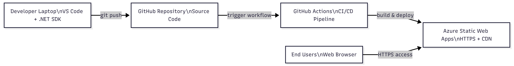
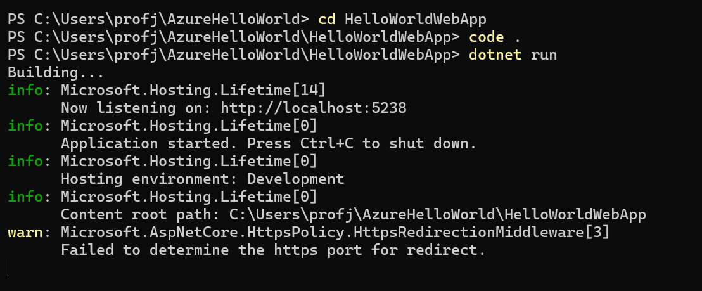
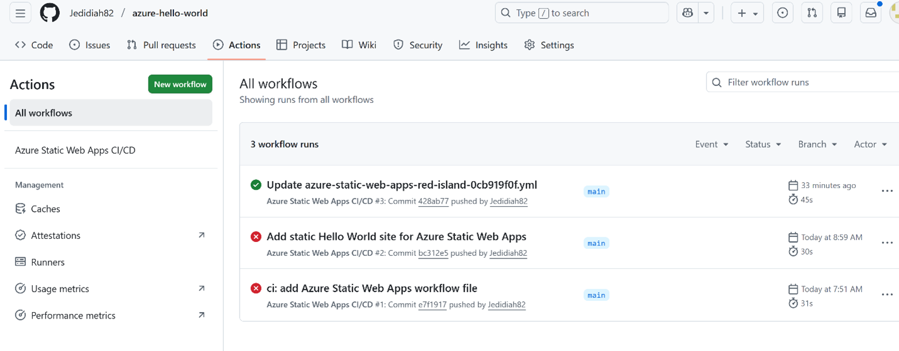
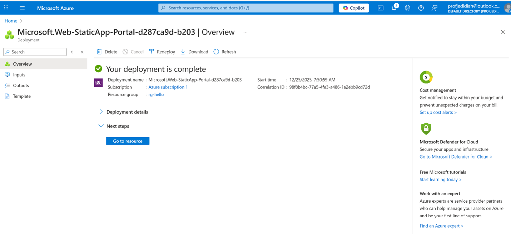

# Azure Hello World – Static Web App Deployment


> **Portfolio Context**  
> This project is part of my **Cloud Computing & Security** portfolio, demonstrating modern Azure-native deployment, DevOps automation, and secure-by-default cloud architecture using **Azure Static Web Apps** and **GitHub Actions**.

---

## Overview

This project demonstrates the deployment of a simple **“Hello World” web application** to Microsoft Azure using **Azure Static Web Apps** and an automated **GitHub Actions CI/CD pipeline**.

It modernizes deprecated **Azure Cloud Service (Web Role)** architectures by adopting a **cloud-native, serverless, and security-first** deployment model aligned with current Azure best practices and industry standards.

---

## Technologies Used

- **ASP.NET Core (.NET 8 LTS)** – application framework  
- **Azure Static Web Apps** – managed, serverless hosting platform  
- **GitHub Actions** – continuous integration and deployment (CI/CD)  
- **Git & GitHub** – version control and source management  
- **Visual Studio Code** – development environment  

---

## Security & Governance Overview

This project demonstrates **NIST Cybersecurity Framework (CSF)**–aligned controls within a **cloud shared responsibility model**.  
Governance and protection are enforced through GitHub repository controls and least-privilege CI/CD deployment.  
Detection and response are supported via GitHub Actions and Azure deployment logs, while recovery is enabled through repeatable, infrastructure-free redeployment from source control.  

Microsoft Azure secures the underlying cloud infrastructure, while application code, CI/CD configuration, and identity governance remain the user’s responsibility.

The following section maps the implemented controls explicitly to the NIST Cybersecurity
Framework (CSF) functions within a cloud shared responsibility model.

## NIST CSF & Shared Responsibility Mapping

This project demonstrates alignment with the **NIST Cybersecurity Framework (CSF)** under a **cloud shared responsibility model**.

### Identify (ID)
- Source code, CI/CD workflows, and deployment configurations are versioned and governed in GitHub.
- Azure subscription and resource groups define asset ownership, scope, and environment boundaries.

### Protect (PR)
- Least-privilege CI/CD deployment using GitHub Actions and Azure Static Web Apps deployment tokens.
- HTTPS enforced by default with no exposed servers, operating systems, or network ports.
- Managed identity, platform hardening, and infrastructure security are handled by Microsoft Azure.

### Detect (DE)
- GitHub Actions logs provide real-time visibility into build and deployment events.
- Azure deployment history and activity logs enable monitoring of configuration and deployment changes.

### Respond (RS)
- CI/CD failures were identified and remediated through workflow configuration updates.
- All changes are traceable and auditable via Git commit history and pipeline logs.

### Recover (RC)
- The application can be redeployed at any time from source using a repeatable CI/CD pipeline.
- No stateful infrastructure recovery is required due to the serverless hosting model.

Under the **cloud shared responsibility model**, Microsoft Azure secures the underlying cloud infrastructure, while the user remains responsible for application code, CI/CD configuration, and identity governance.

---

## Architecture Overview

- Static front-end hosted on **Azure Static Web Apps**
- Automated CI/CD pipeline using **GitHub Actions**
- **HTTPS enforced by default**
- No virtual machines, operating systems, or servers to manage
- Globally distributed content delivery via Azure infrastructure

### Architecture Diagram

The following diagram illustrates the end-to-end workflow from development to secure cloud delivery.



---

## Deployment Flow

1. Application code is developed and tested locally  
2. Code is pushed to the `main` branch on GitHub  
3. GitHub Actions workflow is automatically triggered  
4. Azure builds and deploys the application  
5. The application is published via a secure HTTPS endpoint  

---

## Implementation Evidence

### Local Development & Testing

The application was developed and validated locally using ASP.NET Core prior to cloud deployment.



---

### CI/CD Pipeline Execution

A GitHub Actions workflow automatically builds and deploys the application upon each commit to the `main` branch.



---

### Azure Static Web App Deployment

The application is hosted on Azure Static Web Apps with secure HTTPS access and no exposed infrastructure.




## Deployment Evidence Summary

| Stage | Evidence |
|------|---------|
| Local Development | ASP.NET Core application executed locally via `dotnet run` |
| CI/CD Automation | GitHub Actions workflow triggered on `main` branch commits |
| Cloud Hosting | Azure Static Web App deployed with HTTPS-only access |

---

## Security & Trust Highlights

- Secure-by-default **HTTPS** enforcement  
- No exposed servers, operating systems, or VM attack surface  
- Identity-based deployment via GitHub authentication  
- Immutable and auditable CI/CD pipeline  
- Clear separation between source code and deployment artifacts
- - Cloud-provider-managed patching, certificate rotation, and edge security

---

## Why This Project Matters

- Demonstrates modern Azure cloud deployment practices  
- Replaces deprecated Azure Cloud Service (Web Role) architectures  
- Applies DevOps automation and CI/CD governance  
- Aligns with cloud security, trust, and shared-responsibility principles  
- Suitable for academic assessment, professional portfolios, and interviews  

---

## Live Demo

🔗 https://<your-static-web-app-url>.azurestaticapps.net

---

## Repository Structure

```text
azure-hello-world/
├── README.md
├── static/
│   └── index.html
├── docs/
│   ├── lab-report.md
│   ├── architecture-diagram.png
│   └── screenshots/
│       ├── step1-local-run.png
│       ├── step2-github-actions.png
│       └── step3-azure-portal.png
├── .github/
│   └── workflows/
│       └── azure-static-web-apps-*.yml
└── .gitignore
```

## Author

**Godwin Etim Akpan**  
GIS | Big Data | Cybersecurity | Cloud Computing  
