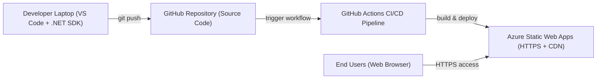

```mermaid
flowchart LR
    Dev["Developer Laptop (VS Code + .NET SDK)"]
    GitHub["GitHub Repository (Source Code)"]
    Actions["GitHub Actions CI/CD Pipeline"]
    Azure["Azure Static Web Apps (HTTPS + CDN)"]
    Users["End Users (Web Browser)"]

    Dev -->|git push| GitHub
    GitHub -->|trigger workflow| Actions
    Actions -->|build & deploy| Azure
    Users -->|HTTPS access| Azure
```