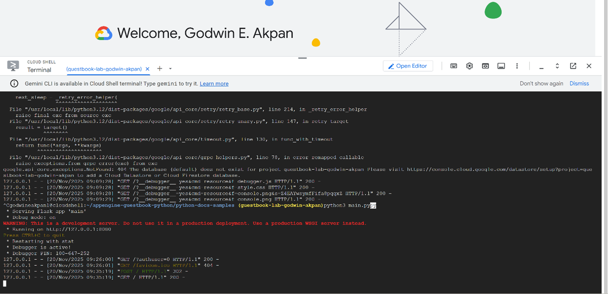
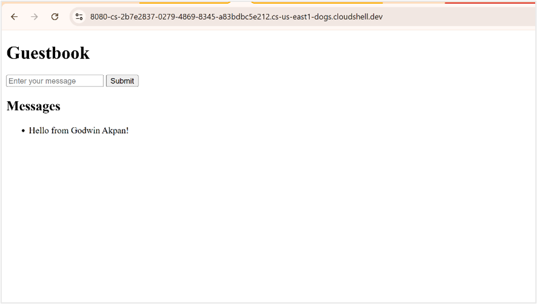
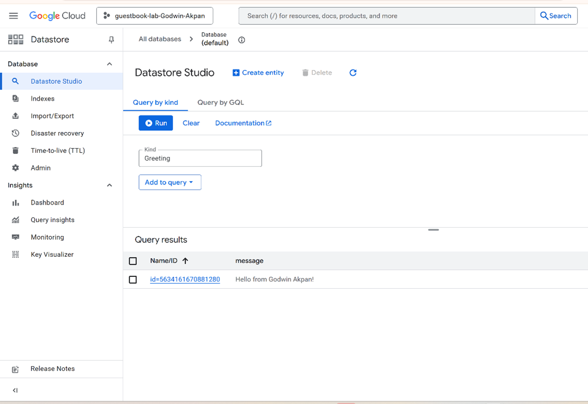
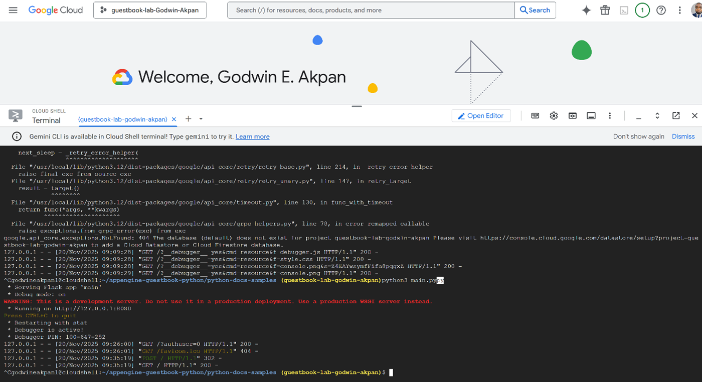

# ☁️ Google App Engine Guestbook Application


**Serverless Python App • App Engine (PaaS) • Firestore (Datastore Mode) • Cloud Shell**

---

## 📌 Project Overview

This project demonstrates **end-to-end deployment of a cloud-native Python Guestbook application** using **Google App Engine (Standard Environment)** with **Firestore in Datastore Mode** as a managed NoSQL backend.

The lab covers the full lifecycle of a modern cloud application:

- Local execution in **Google Cloud Shell**
- Frontend–backend integration using **Flask**
- Persistent data storage using **Cloud Datastore**
- Serverless deployment to **Google App Engine (PaaS)**
- Real-world cloud troubleshooting and modernization, including runtime deprecations and datastore initialization errors

No virtual machines or servers were managed directly, highlighting **platform-as-a-service (PaaS)** and **serverless architecture principles**.

---

## 🎯 Lab Objectives

- Create and configure a new Google Cloud project
- Execute a Python Flask application locally in Cloud Shell
- Initialize Firestore in Datastore Mode
- Persist and retrieve user messages via a NoSQL backend
- Deploy a production-ready application to Google App Engine
- Validate application behavior via web UI and Datastore Studio
- Diagnose and resolve runtime, dependency, and deployment errors

---

## 🛠️ Tools & Environment

| Component | Purpose |
|---------|--------|
| Google Cloud Platform | Cloud infrastructure & services |
| Cloud Shell | Linux-based development environment |
| Flask | Python web framework |
| Firestore (Datastore Mode) | Serverless NoSQL database |
| Google App Engine | PaaS application hosting |
| gcloud CLI | Deployment & project management |
| Git | Source code management |

---

## 🏗️ Architecture Overview

```mermaid
flowchart LR
    A[User Browser] -->|HTTP Requests| B[Google App Engine<br/>(Python 3 Runtime)]
    B -->|Datastore Client API| C[Firestore<br/>(Datastore Mode)]
    C -->|Managed Storage| D[Serverless Persistence Layer]
```

---

## 🧪 Lab Implementation

### 1️⃣ Project Creation & Cloud Shell Setup

- Logged into Google Cloud Console
- Created project: `guestbook-lab-godwin-akpan`
- Launched Cloud Shell (preconfigured Linux container)
- Verified active project context

```bash
gcloud config list
```

---

### 2️⃣ Cloning the Guestbook Application

```bash
git clone https://github.com/GoogleCloudPlatform/python-docs-samples --depth=1
cd python-docs-samples/appengine/standard/guestbook
```

**Observation**
- Legacy Python 2 App Engine samples were deprecated  
- Required migration to Python 3 + Flask  
- Demonstrated ability to recognize and adapt outdated cloud examples  

---

### 3️⃣ Installing Dependencies

```bash
pip install -r requirements.txt
```

- Dependency version warnings observed (e.g., protobuf, grpc)
- Application executed successfully despite shared Cloud Shell environment constraints

---

### 4️⃣ Running the Application Locally

```bash
python3 main.py
```

- Application launched on http://127.0.0.1:8080
- Accessed via Cloud Shell Web Preview
- Successfully submitted guestbook messages
- Verified frontend–backend communication

---

### 5️⃣ Configuring Firestore (Datastore Mode)

- Navigated to Datastore setup  
- Enabled Firestore in Datastore Mode  
- Multi-region: `nam5`  
- Open rules (testing environment)  

This resolved initial datastore access errors.

---

### 6️⃣ Submitting & Displaying Messages

- Submitted message: **“Hello from Godwin Akpan!”**  
- Message immediately rendered on the Guestbook UI  
- Confirmed correct request handling and backend persistence  

---

### 7️⃣ Verifying Data in Datastore Studio

- Opened Datastore Studio  
- Queried kind: `Greeting`  
- Verified stored entity and message value  

---

### 8️⃣ Troubleshooting & Cloud Modernization

#### 🔴 Issue 1: Python 2 Runtime Deprecation

**Error**
```text
Runtime python27 is end of support
```

**Resolution**
- Migrated to Python 3.10 App Engine runtime  
- Updated `app.yaml`:

```yaml
runtime: python310
entrypoint: gunicorn -b :$PORT main:app
```

---

#### 🔴 Issue 2: Datastore Not Initialized

**Error**
```text
404 The database (default) does not exist
```

**Resolution**
- Enabled Firestore in Datastore Mode via GCP Console

---

#### 🔴 Issue 3: Deprecated Python Modules

**Error**
```text
ModuleNotFoundError: No module named 'cStringIO'
```

**Resolution**
- Replaced legacy Python 2 code with Flask-based Python 3 implementation  

---

### 9️⃣ Deploying to Google App Engine

```bash
gcloud app create --region=us-central
gcloud app deploy
gcloud app browse
```

**Deployment URL**
```text
https://guestbook-lab-godwin-akpan.uc.r.appspot.com
```

---

## 📊 Results

- Flask application executed locally and in production  
- Messages persisted in Firestore (Datastore Mode)  
- Serverless App Engine deployment successful  
- Datastore reads/writes verified  
- Cloud errors diagnosed and resolved  

---

## 📸 Screenshots

<p align="center">
  
  
</p>

<p align="center">
  
  
</p>

**Screenshots shown:**
- Cloud Shell running Flask application  
- Guestbook web UI with submitted message  
- Datastore Studio showing stored entity  
- App Engine deployment logs  

---

## 💼 Resume Bullet (Cloud-Optimized)

> Deployed a Python Flask Guestbook application to **Google App Engine (PaaS)** using **Firestore in Datastore Mode**, demonstrating serverless application hosting, NoSQL persistence, Cloud Shell development, IAM-aware access, and cloud troubleshooting across runtime deprecations and deployment errors.

---

## 👤 Author

**Godwin Etim Akpan**  
GIS • Big Data • Cybersecurity • Cloud Computing