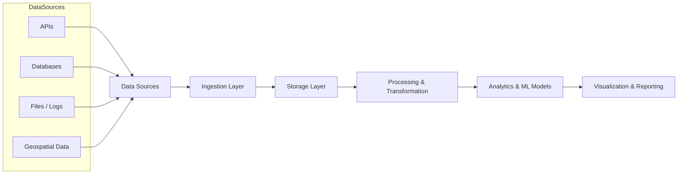

# 🏗️ Data Engineering & Analytics Engineering

📦 Python • SQL • ETL/ELT • Spark • Airflow • Kafka • Data Warehousing • Microsoft Fabric  

---

## Overview

This section focuses on the design and implementation of **scalable data pipelines** that support machine learning, geospatial analytics (GeoAI), and decision-support systems.

It extends the work in **Big Data & Machine Learning** into production-oriented environments, enabling reliable data ingestion, transformation, orchestration, and delivery at scale.

---

## Related Flagship Project

[Privacy-Preserving GeoAI Health Surveillance System](https://github.com/Jedidiah82/GeoAI-Health-Surveillance-System)

See the [Public Health GeoAI section](../2_PublicHealth_GeoAI) for the dissertation context, spatial epidemiology applications, and public-health decision-support focus.

---

## Core Capabilities

- End-to-end data pipeline development (ETL/ELT using Python & SQL)  
- Distributed data processing (Spark, PySpark, Hadoop ecosystem)  
- Data modeling and transformation (structured and semi-structured data)  
- Workflow orchestration and scheduling (Airflow concepts)  
- Streaming and event-driven processing (Kafka fundamentals)  
- Integration of pipelines with machine learning workflows  
- Geospatial data processing (GeoPandas, spatial joins, feature engineering)  

---

## Pipeline Architecture



---

## Key Focus Areas

- Building reusable and scalable data pipelines  
- Preparing high-quality datasets for machine learning and analytics  
- Integrating structured, unstructured, and geospatial data  
- Supporting batch and real-time processing workflows  
- Enabling data-driven decision systems across domains  

---

## Application Areas

- Public health surveillance and data systems  
- GeoAI and spatial analytics pipelines  
- Cybersecurity log ingestion and threat analytics  
- Infrastructure and environmental data processing  
- Cloud-based analytics platforms  

---

## Relationship to Other Portfolio Sections

This section connects directly with:

- **Big Data & Machine Learning** → distributed analytics and model development  
- **Public Health GeoAI** → spatio-temporal data pipelines and forecasting  
- **GIS & Spatial Data Science** → geospatial data processing and feature engineering  
- **Cloud Computing & Security** → scalable and secure infrastructure  
- **Automation & Reliability** → monitoring, scheduling, and operational workflows  

---

## Example Use Cases in This Portfolio

- Data preparation pipelines for intrusion detection (UNSW-NB15)  
- Feature engineering workflows for GeoAI forecasting models  
- Streaming log ingestion and transformation (NASA dataset)  
- Integration of multi-source datasets for spatial analysis  

---

## 🧱 Microsoft Fabric & Power BI (Developing Competency)

This section represents ongoing work in **modern analytics engineering using the Microsoft ecosystem**, including Microsoft Fabric, Power BI, and real-time analytics.

It complements existing data engineering capabilities by introducing **lakehouse architectures, semantic modeling, and enterprise BI workflows**.

---

### Focus Areas

- Fabric Lakehouse architecture (Bronze → Silver → Gold layers)  
- Data transformation using PySpark and SQL notebooks  
- Dataflows Gen2 for ingestion and preparation  
- Pipeline orchestration for ETL/ELT workflows  
- Power BI semantic modeling (star schema, DAX measures)  
- Real-time analytics using KQL and event streams  

---

### Capabilities (In Progress)

- Lakehouse design and Delta table management  
- Data modeling and KPI development in Power BI  
- Pipeline scheduling and monitoring  
- Interactive dashboard development for decision support  
- Integration of batch and streaming analytics workflows  

---

### Planned Project Structure

```text
Microsoft_Fabric_Analytics/
│
├── notebooks/ # PySpark, SQL, KQL
├── lakehouse/ # Medallion architecture
├── pipelines/ # Fabric pipelines
├── dataflows/ # Dataflows Gen2
├── powerbi_reports/ # Dashboards & models
└── figures/ # Architecture diagrams
```

---

### Planned Use Cases

- Public health surveillance dashboards (Power BI)  
- Lakehouse pipelines for structured and streaming data  
- KPI monitoring systems (trend, anomaly detection, forecasting)  
- Integration of GeoAI outputs into analytics dashboards  

---

### Learning & Certification Path

- Microsoft Certified: Fabric Analytics Engineer (DP-600) *(In Progress)*  
- Microsoft Certified: Fabric Data Engineer (DP-700) *(In Progress)*  
- Microsoft Certified: Power BI Data Analyst (PL-300) *(In Progress)*  

---

### Future Direction

- End-to-end Fabric + Azure analytics pipelines  
- Real-time dashboards using Eventstream  
- Fabric integration with GeoAI workflows  
- Enterprise-scale analytics engineering solutions  

---

## Professional Development

- MSc Big Data Technologies *(Data Engineering & Distributed Systems)*  
- IBM Data Engineering Professional Certificate  
- Google IT Automation with Python  

---

## Key Takeaway

This section demonstrates the ability to design **scalable, production-oriented data systems** that transform raw data into structured, high-quality inputs for machine learning, GeoAI, and decision-support applications.
