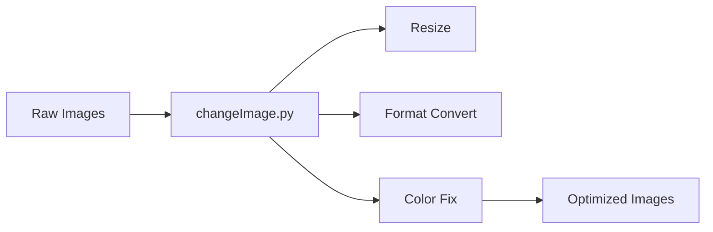

# 🖼️ Image Processing & Data Standardization Pipeline  

## 🧠 Overview  

This project automates the processing and standardization of image files to support **GeoAI, GIS, and cloud ingestion pipelines**.

It reflects real-world workflows used in **data engineering, spatial analytics, and content management systems**, where imagery must meet defined size, format, and quality standards before being used in analytics, mapping, or machine-learning pipelines.

---

## 🎯 Objectives  

The system is designed to:  

- Convert images to a standardized format  
- Resize images for performance optimization  
- Remove unsupported color channels  
- Ensure consistent file naming  
- Prepare images for API and cloud upload  

---

## 🛠️ Tools & Technologies  

| Category | Tools |
| --------- | ------- |
| Language | Python |
| Image Processing | Pillow (PIL) |
| File Handling | OS |
| Automation | Bash / cron |
| OS | Linux |

---

## ⚙️ How It Works  

1. Scans an input directory for image files  
2. Converts images to JPEG format  
3. Resizes to standardized dimensions  
4. Converts RGBA to RGB  
5. Saves optimized versions for upload  

---

## 🏗️ System Architecture



---

## 🧪 Key Features  

- 🖼️ Automated image conversion  
- 📐 Resolution standardization  
- 🎨 Color channel optimization  
- 📁 Batch processing  
- ⚡ Performance-ready outputs  

---

## 🗂️ Project Structure  

```text
image_processing_pipeline/
│
├── changeImage.py
└── README.md
```

---

## 🚀 Example Use Case  

This tool can be used in:  

- GeoAI training data preparation
- Cloud data ingestion pipelines  
- Digital asset management  
- Web application uploads  
- GIS imagery preparation  
- Enterprise content systems  
- Satellite imagery preprocessing
- GIS basemap standardization
- Drone imagery pipelines

---

## 📌 Sample Transformation  

| Before | After |
| -------- | ------- |
| TIFF (3000x2000) | JPEG (600x400) |
| RGBA | RGB |
| Large file | Optimized |

---

## 📎 Skills Demonstrated  

- Python scripting  
- Image processing  
- Data standardization  
- Automation workflows  
- File system handling  

---

## 🔗 Related Portfolio Pillar  

Part of:  
**⚙️🛡️📊 Automation, Reliability & Secure Data Systems**  

---

## 🧭 Next Steps  

Planned improvements:  

- Cloud image upload integration  
- Metadata extraction  
- EXIF validation  
- Image quality scoring  
- API-based processing  
