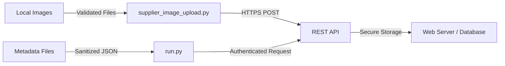

# 🔐 Secure File Upload & API Data Ingestion (REST)

## 🧠 Overview

This project demonstrates a secure, automated workflow for uploading files and structured metadata to a web server using REST APIs.

It simulates real-world **cloud, enterprise, and public-sector ingestion pipelines**, where images and form data must be transferred securely, validated, and processed at scale.

## 🎯 Objectives

- Upload image files via HTTP `POST` requests  
- Submit structured metadata as JSON payloads  
- Validate API responses using HTTP status codes  
- Support repeatable, batch-based ingestion workflows  
- Support privacy-aware data ingestion workflows
- Enable secure public-sector data exchange

## 🛠️ Tools & Technologies

| Category | Tools |
| --- | --- |
| Language | Python |
| HTTP Client | `requests` |
| API Style | REST |
| Data Format | JSON |
| OS | Linux |

## ⚙️ How It Works

1. Images are read from a local directory  
2. Files are uploaded using `multipart/form-data`  
3. Metadata is parsed from text files  
4. JSON payloads are sent to an API endpoint  
5. Server responses are validated for success 

---

## 🏗️ System Architecture



---

## 🧪 Key Features

- Automated file upload using REST APIs  
- JSON-based data ingestion  
- Batch processing for scalability  
- Response validation for reliability  

---

## 🗂️ Project Structure

```text
4_Secure_File_Upload_API/
├── supplier_image_upload.py   # Uploads image files
├── run.py                     # Sends JSON metadata to the API
└── README.md
```

---

### Usage

### Upload Images

```bash
chmod +x supplier_image_upload.py
./supplier_image_upload.py
```

## Upload Metadata (JSON)

```bash
chmod +x run.py
./run.py
```

## Sample JSON Payload

```json
{
  "name": "Watermelon",
  "weight": 500,
  "description": "High water content fruit",
  "image_name": "010.jpeg"
}
```

## 🚀 Example Use Cases

- Cloud data ingestion pipelines
- GIS imagery uploads to catalog systems
- Public health portals for media + form data
- Secure web applications with bulk uploads
- Public health media uploads
- Disaster response data portals
- GIS asset repositories

## 📎 Skills Demonstrated

- REST API integration
- Secure file transfer workflows
- JSON data handling
- Python automation for ingestion systems

## 🔗 Related Portfolio Pillar

Part of:
⚙️🛡️📊 **Automation, Reliability & Secure Data Systems**

## 🧭 Next Steps (Planned Improvements)

- API authentication (OAuth / API keys)
- Retry logic for network failures
- Centralized logging
- File integrity validation
- Cloud storage integration (S3 / GCS / Azure Blob)
