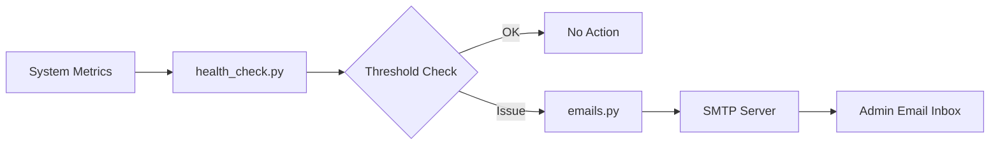

# 🖥️🛡️ System Health Monitoring & Automated Alerting  

---

## 🧠 Overview  

This project implements an automated **system health monitoring and alerting tool** designed to support **data platforms, GeoAI pipelines, and public health information systems** by ensuring infrastructure reliability and availability.

It simulates real-world **IT operations, DevOps, and reliability engineering** workflows used in enterprise and public-sector environments to prevent downtime and maintain continuous analytics, surveillance, and reporting services.

---

## 🎯 Objectives  

The system monitors critical infrastructure indicators:  

- **CPU usage** (> 80%)  
- **Disk space** (< 20%)  
- **Available memory** (< 100MB)  
- **Hostname resolution** (localhost → 127.0.0.1)  

If any condition fails, an automated **alert email** is sent to administrators to support rapid response and service continuity.  

---

## 🛠️ Tools & Technologies  

| Category | Tools |
|---------|-------|
| Language | Python |
| Monitoring | psutil, shutil |
| Networking | socket |
| Automation | cron |
| Alerts | SMTP |
| OS | Linux |

---

## ⚙️ How It Works  

- Collects system metrics using `psutil`  
- Evaluates against predefined thresholds  
- Detects DNS resolution failures  
- Sends alert email if an issue is found  
- Can be scheduled with `cron` to run every 60 seconds  

---

## 🏗️ System Architecture



---

## 🧪 Key Features  

- 🔍 Real-time system diagnostics  
- 📧 Automated email alerts  
- 🕒 Scheduled monitoring via cron  
- 🛡️ Reliability-focused checks  
- 📈 Infrastructure readiness validation  

---

## 🗂️ Project Structure  

```text
system_health_monitoring/
│
├── health_check.py
├── emails.py
└── README.md
```

---

## 🚀 Example Use Case  

This tool can be used in:  

- IT Support Operations  
- DevOps Monitoring  
- Cloud Infrastructure Health Checks  
- Cybersecurity SOC environments  
- Data Engineering reliability workflows
- GeoAI model pipeline uptime monitoring
- Public health dashboard and surveillance systems reliability checks

---

## 📌 Sample Alert Scenarios  

| Condition | Alert Triggered |
|----------|------------------|
| CPU > 80% | Yes |
| Disk < 20% | Yes |
| Memory < 100MB | Yes |
| DNS Failure | Yes |

---

## 📎 Skills Demonstrated  

- System monitoring  
- Python automation  
- Infrastructure reliability  
- Alerting systems  
- Linux task scheduling  
- Operational resilience  

---

## 🔗 Related Portfolio Pillar  

Part of:  
**⚙️🛡️📊 Automation, Reliability & Secure Data Systems**  

---

## 🧭 Next Steps  

Planned improvements:  

- Slack / Teams alert integration  
- Grafana dashboard  
- Dockerized deployment  
- Cloud monitoring (AWS / Azure)  
