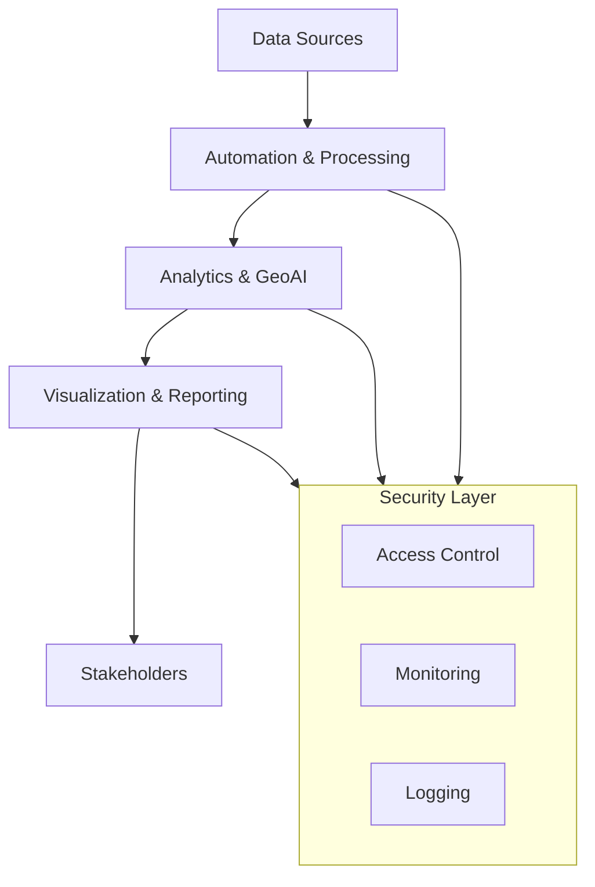

<h1 align="center">📊 Data Analytics • GIS–GeoAI • Cloud, Cybersecurity & Public Health Intelligence Portfolio</h1>

<p align="center">
  <strong>Godwin Etim Akpan</strong><br>
  MSc Big Data Technologies (In Progress)
</p>

<p align="center">
  📍 Raleigh, North Carolina • 
  <a href="https://github.com/Jedidiah82"><strong>GitHub</strong></a> •
  <a href="https://www.linkedin.com/in/godwin-etim-akpan-822a5a43/"><strong>LinkedIn</strong></a> •
  <a href="mailto:godwineakpan1@gmail.com"><strong>Email</strong></a>
</p>

<p align="center">
  
  
  
  
  
  
  
</p>

---

## Professional Summary

Data & Geospatial Analytics Leader with 10+ years of experience delivering intelligence-driven solutions across public health, infrastructure, and emergency response in Africa and the United States.

Specialized in GeoAI, Big Data Analytics, Cloud Computing (AWS, Azure, GCP), Cybersecurity Analytics, and IT Automation, with a proven track record in outbreak surveillance, hazard mapping, spatial risk modeling, and secure data engineering.

Trained through an MSc in Big Data Technologies, Google IT Automation with Python, and AWS Educate, with hands-on expertise in cloud infrastructure, security engineering, and scalable analytics pipelines.

Known for translating complex, multi-source datasets into actionable intelligence that informs policy, preparedness, infrastructure planning, and security operations.

Open to strategic, high-impact collaborations where data, geospatial intelligence, and secure systems drive real-world outcomes.

---

**Domains of Expertise:**  
Data Analytics, GIS/GeoAI, Cloud Engineering, Cybersecurity Analytics, Public Health Informatics  

---

## Professional Impact

- Led GIS and analytics initiatives supporting national disease surveillance and emergency response  
- Designed GeoAI-driven forecasting models for outbreak prediction and spatial risk analysis  
- Built secure, cloud-based data pipelines for public health and infrastructure intelligence  
- Delivered executive-ready dashboards and technical reports for decision-makers  
- Operated in high-impact, resource-constrained environments across Africa and the United States  

---

## Mission Statement

To build intelligent, secure, and data-driven systems that strengthen public health, protect critical infrastructure, and empower decision-makers through geospatial and analytical excellence.

---

## Strategic Engagement Areas

### Consulting & Advisory
- Data & Analytics Strategy  
- GeoAI & Spatial Intelligence Consulting  
- Public Health Informatics Advisory  
- Cloud & Security Architecture Guidance  

### Data & GeoAI Leadership
- Data Science & Advanced Analytics  
- GIS / GeoAI Systems Design  
- Spatial Epidemiology & Surveillance Intelligence  
- AI-Driven Decision Support Systems  

### Cloud & Security Engineering
- Cloud Infrastructure Engineering (AWS, Azure, GCP)  
- Cloud Security & IAM Architecture  
- SOC Analytics & Threat Intelligence  
- Secure Data Platforms  

### Public Health Informatics
- Disease Surveillance Systems  
- Health Data Engineering  
- Epidemiological Analytics  
- Emergency & Disaster Intelligence  

### Analytics Engineering
- Big Data Pipelines (Spark, Hive, PySpark)  
- Automation & Monitoring Systems  
- Reporting & Visualization Platforms  
- Scalable Decision Support Tools  

---

## Portfolio Overview

This portfolio showcases applied and research-driven work at the intersection of:

- **Big Data Engineering & Distributed Machine Learning**  
- **GeoAI & Spatial Epidemiology**  
- **GIS & Remote Sensing**  
- **Cloud Computing & Security Engineering**  
- **Cybersecurity Analytics**  
- **IT Automation & Systems Engineering**  
- **Public Health Informatics**  

Projects span academic research, applied analytics, emergency management, national surveillance systems, and environmental/public health intelligence across Africa and the United States.

---

## System-Wide Portfolio Architecture



---

## Featured Projects

- **[Lassa Fever GeoAI Forecasting](https://github.com/Jedidiah82/Analytics-GIS-GeoAI-Portfolio/tree/main/2_PublicHealth_GeoAI/Lassa_GeoAI_Forecasting_2016_2026)**  
  Predictive disease modeling to support early-warning surveillance and public health preparedness.

- **[Intrusion Detection (UNSW-NB15)](https://github.com/Jedidiah82/Analytics-GIS-GeoAI-Portfolio/tree/main/1_BigData_and_ML/2_UNSW_NB15_Intrusion_Detection)**  
  Big Data cybersecurity analytics using Hive and PySpark.

- **[NCEM Flood Exposure Mapping](https://github.com/Jedidiah82/Analytics-GIS-GeoAI-Portfolio/tree/main/3_GIS_Spatial_DataScience/BuildingFootprint_Demo_NCEM)**  
  Hazard exposure analysis for emergency management.

- **[Cloud Infrastructure / CloudSim](https://github.com/Jedidiah82/Analytics-GIS-GeoAI-Portfolio/tree/main/4_Cloud_Computing_Security/cloudsim-performance-lab)**
  Cloud performance simulation & infrastructure modeling.  

- **[AWS EC2 CLI Lab](https://github.com/Jedidiah82/Analytics-GIS-GeoAI-Portfolio/tree/main/4_Cloud_Computing_Security/aws-ec2-cli-lab)**
  Hands-on AWS infrastructure provisioning and management using CLI.  

- **[System Health Monitoring Automation](https://github.com/Jedidiah82/Analytics-GIS-GeoAI-Portfolio/tree/main/6_Automation_Reliability/System_Health_Monitoring)**  
  Automated infrastructure monitoring and alerting.

---

## Publications & Research Impact

My work includes applied research and field-based analytics in public health, epidemiology, and geospatial intelligence.

Key areas of contribution:

- Lassa Fever surveillance and spatial risk analysis  
- COVID-19 outbreak monitoring and dashboard systems  
- Malaria vector distribution modeling  
- Emergency preparedness and health systems strengthening  
- Spatial epidemiology and disease trend analysis  

These efforts have supported:

- National disease surveillance programs  
- Emergency response coordination  
- Data-driven public health policy  
- Capacity building for health institutions  

Select research outputs and technical reports are available within this portfolio.

---

## Thought Leadership & Vision

I believe the future of public health, infrastructure resilience, and security intelligence lies in the **integration of GeoAI, Big Data, and cloud-native systems**.

My vision is to help organizations move from reactive decision-making to **predictive, intelligence-led operations** by:

- Embedding GeoAI into surveillance and early warning systems  
- Designing secure, scalable data platforms for health and emergency response  
- Using spatial intelligence to guide infrastructure and climate resilience planning  
- Applying cybersecurity analytics to protect critical data ecosystems  

Through research, applied analytics, and technical leadership, I aim to shape how data is used to **protect lives, systems, and communities**.

---

## DevOps & Automation Workflow


---

## Portfolio Pillars

Below are the core pillars of the portfolio, each with dedicated project folders.

---

# 1️⃣ Big Data & Machine Learning  
_📦 Spark • Hive • PySpark • ML Pipelines • Feature Engineering_

| # | Project | Tools | Focus |
|---|---------|--------|--------|
| 1 | ML on Big Data (Tasks 1a–1c) | Spark, Python, Word2Vec | Semantic embeddings & clustering |
| 2 | Intrusion Detection (UNSW-NB15) | Hive, PySpark | Cybersecurity ML pipeline |
| 3 | Language Model Discounting | PySpark, NLP | Statistical LM estimation |
| 4 | NASA Real-Time Streaming | Spark Streaming | Log analytics at scale |
| 5 | Toronto Location Intelligence | Python, Foursquare | Spatial business analytics |

---

# 2️⃣ Public Health GeoAI & Spatio-Temporal Modeling  
_📦 Disease Forecasting • Hotspot Modeling • Surveillance Analytics_

| Project | Tools | Focus |
|---------|--------|--------|
| Lassa Fever GeoAI Forecasting | Python, XGBoost, Prophet, GeoPandas | Predictive modeling (2016–2026) |
| Epidemiological Publications | R, GIS | Peer-reviewed public health research |
| Spatial Epidemiology Studies | ArcGIS, Python | Clustering & temporal trends |

---

# 3️⃣ GIS, Spatial Data Science & Remote Sensing  
_📦 ArcGIS Pro • QGIS • Remote Sensing • Raster Analytics_

| Project | Tools | Focus |
|---------|--------|--------|
| NCEM Building Footprint Flood Exposure | GeoPandas, ArcGIS | Hazard impact QC & mapping |
| Road Network Digitization | ArcGIS | Infrastructure mapping |
| Crash Hotspot Analysis | KDE, ArcGIS | Transportation safety |
| Land Degradation Analysis | Sentinel-2, NDVI | Environmental monitoring |
| Sea Level Rise (3D) | ArcGIS Pro | Climate visualization |
| Airport Site Suitability | GIS/MCDA | Infrastructure planning |
| Africa FETP Implementation Map | ArcGIS Online | Epidemiology workforce |
| AFENET Public Health Footprint | GIS | Multi-project mapping |
| OneHealth RCCE Stakeholder Map | KoboToolbox + GIS | Preparedness mapping |
| Emergency Preparedness Training Map | GIS | Disaster readiness |

---

# 4️⃣ Cloud Computing & Security Engineering

_📦 AWS • Azure • GCP • IAM • Cloud Security • SIEM • Threat Detection_

This section includes hands-on cloud infrastructure labs, security engineering projects, 
private cloud deployments, and performance simulations across AWS, Azure, GCP, OpenStack, 
and Hadoop-based environments.

### Cloud Platforms (Hands-On)
- AWS (EC2, S3, IAM, VPC)  
- Azure (AD, Resource Groups)  
- GCP (IAM, Compute)  

### Cloud Security (Applied)
- Identity & Access Management  
- Threat detection & SIEM integration  
- CIS hardening foundations  
- Network segmentation & secure VPC design  
- Compliance-aligned configurations  

### Cybersecurity Analytics (SOC-Focused)
- Splunk log analysis & alert tuning  
- Threat intel (VirusTotal, GreyNoise)  
- Email investigations & phishing detection  
- Malware triage support  
- Vulnerability assessment fundamentals  

---

# 5️⃣ Data Engineering & Analytics Engineering (Established Competency)
📦 Python • SQL • ETL/ELT • Spark • Airflow • Kafka • Data Warehousing

This pillar represents established, production-oriented data engineering and analytics
engineering capabilities developed through advanced academic training and applied
projects in the MSc Big Data Technologies program.

Work in this area demonstrates the design, implementation, and evaluation of scalable data platforms supporting large-scale analytics, machine learning pipelines, and decision-support systems.

Core capabilities include:
• End-to-end data engineering pipelines (Python, SQL, ETL/ELT)
• Relational, NoSQL, and Big Data systems (RDBMS, Spark, Hadoop)
• Distributed processing and ML-enabled data pipelines (Spark, PySpark, ML workflows)
• Workflow orchestration and streaming fundamentals (Airflow, Kafka)
• Analytics engineering practices (data modeling, transformation layers, curated datasets)
• Cloud-agnostic lakehouse and warehouse patterns supporting BI and ML workloads

This competency is being **formalized and industry-aligned** through the
**IBM Data Engineering Professional Certificate**, reinforcing best practices, tooling standards, and employer-recognized credentials that formalize and extend the theoretical and applied foundation of the **MSc Big Data Technologies** program. 

---

# 6️⃣ Automation, Reliability & Secure Data Systems  
_📦 Python • APIs • System Monitoring • Reporting • Workflow Automation_

This pillar demonstrates how automation enhances **secure, scalable, and reliable**  
data operations for geospatial, public health, and cloud-based systems.

| Project | Tools | Focus |
|--------|--------|--------|
| System Health Monitoring | Python, psutil, SMTP | Proactive infrastructure alerts |
| Automated Report Generation | Python, ReportLab | PDF analytics reporting |
| Image Processing Pipeline | PIL, APIs | Data standardization |
| Secure File Upload Scripts | Requests, REST APIs | Cloud-ready ingestion |
| Email Automation System | Python, SMTP | Operational communication |
| Log Processing Scripts | Python | Reliability engineering |

_These projects support secure GeoAI, public health analytics, and cloud-enabled systems._

**Lab Source:**  
Automation projects are based on the **Google IT Automation with Python Professional Certificate**.

### Focus Areas

- Automation for data pipelines  
- System reliability & monitoring  
- Secure communication workflows  
- API-driven data exchange  
- Operational efficiency  

_These projects support secure GeoAI, public health analytics, and cloud-enabled systems._

---

## Technical Skills Overview

**Data & ML:**  
Python • Spark • Hive • SQL • Pandas • GeoPandas • XGBoost • Prophet • scikit-learn  

**GIS & GeoAI:**  
ArcGIS Pro • ArcGIS Online • QGIS • Shapely • Rasterio • Remote Sensing  

**Public Health Analytics:**  
DHIS2 pipelines • Epidemiological modeling • Outbreak dashboards  

**Cloud:**  
AWS • Azure • GCP • IAM • VPC • Cloud Security  

**Cybersecurity:**  
Splunk • Nessus • Wireshark • Nmap • Maltego • OSINT Tools  

**Automation & Systems:**  
Python • Linux • Bash • Regex • Log Analysis • Monitoring • Reporting  

**Visualization:**  
ArcGIS Dashboards • Matplotlib • Seaborn • Power BI • Fabric Visuals  

---

## Skills Matrix (Role-Aligned Competencies)

| Skill Area | Tools & Technologies | Expertise Level | Evidence |
|-----------|----------------------|------------|----------|
| Data Analytics | Python, Pandas, SQL, Power BI, Fabric | Advanced | Public health dashboards, analytics reports |
| Big Data | Spark, Hive, PySpark, Hadoop | Advanced | UNSW-NB15 intrusion detection, streaming labs |
| GIS & GeoAI | ArcGIS Pro, QGIS, GeoPandas, Remote Sensing | Expert | NCEM flood mapping, AFENET projects |
| Public Health Informatics | DHIS2, Surveillance Dashboards, R | Advanced | Lassa Fever forecasting, epidemiology studies |
| Cloud Computing | AWS, Azure, GCP, OpenStack | Intermediate | EC2 CLI lab, Azure Web App, Datastore |
| Cybersecurity | Splunk, Nessus, Wireshark, IAM | Intermediate | SOC training, crypto labs |
| Automation | Python, Bash, APIs, Monitoring | Intermediate | System health monitoring, reporting pipelines |
| Visualization | ArcGIS Dashboards, Matplotlib, Seaborn | Advanced | Maps, plots, executive dashboards |
| Security & Compliance | NIST CSF, ISO 27001, IAM, CIS Benchmarks | Intermediate | Cloud security labs, cryptography projects |

---

## Certifications & Training

- Esri GIS & Spatial Data Science Certifications  
- IBM Data Science Professional Certificate  
- R for Applied Epidemiology (Applied Epi)  
- Google IT Automation with Python  
- Splunk Core Certified User  
- CompTIA Cybersecurity Analyst (CySA+)  
- CompTIA Security+ (CE)  
- Field Epidemiology Training Program (FETP), Frontline & Intermediate Tier  
- Project Management in Global Health (University of Washington)  

---

## Reproducibility

Each project folder includes:

- `README.md`  
- Python scripts  
- Jupyter Notebooks  
- `figures/` (maps, plots, charts)  
- `data_template/`  
- GIS boundaries  

Install dependencies:

```bash
pip install -r requirements.txt
```

---

## Future Additions
- Large-scale GeoAI using Spark
- Automated Lassa Fever EWS dashboard
- Hazard dashboards (NCEM-style)
- AWS Security Engineering labs
- Cloud + GeoAI integrated workflows
- Public health early warning systems

---

## © 2025 – Godwin Etim Akpan
**Big Data • GeoAI • GIS • Cloud Security • IT Automation • Public Health Informatics**
