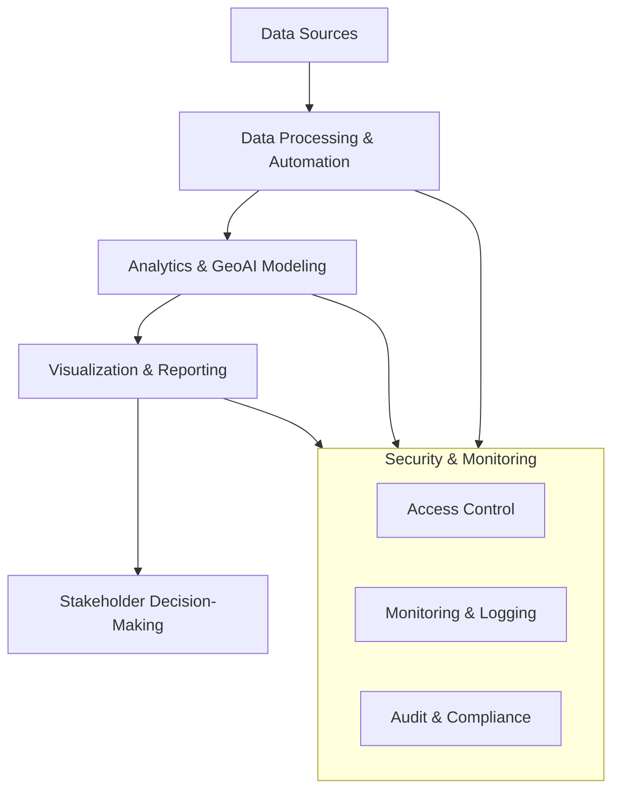
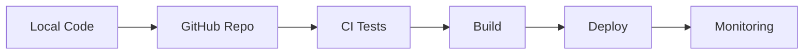

<h1 align="center">📊 Data Analytics • GeoAI • Big Data • Cloud & Cybersecurity Portfolio</h1>

<p align="center">
  <strong>Godwin Etim Akpan</strong><br>
  Applied Data Scientist & GIS Specialist • MSc Big Data Technologies (In Progress)
</p>

<p align="center">
  📍 Raleigh, North Carolina • 
  <a href="https://github.com/Jedidiah82"><strong>GitHub</strong></a> •
  <a href="https://www.linkedin.com/in/godwin-etim-akpan-822a5a43/"><strong>LinkedIn</strong></a> •
  <a href="mailto:godwineakpan1@gmail.com"><strong>Email</strong></a>
</p>

<p align="center">
  
  
  
  
  
  
  
</p>

---

## 🔍 Overview

Applied Data Scientist & GIS Specialist with 10+ years of experience building data-driven solutions across public health, infrastructure, and environmental systems.

This portfolio demonstrates the integration of:

- Machine Learning & GeoAI  
- Big Data Engineering (Spark, Hive, PySpark)  
- Cloud Computing & Security  
- Cybersecurity Analytics  
- Automation & Monitoring Systems  

to deliver scalable, real-world decision-support solutions.

---

## 🧠 System Architecture



---

## Featured Projects

- **[Lassa Fever GeoAI Forecasting](https://github.com/Jedidiah82/Analytics-GIS-GeoAI-Portfolio/tree/main/2_PublicHealth_GeoAI/Lassa_GeoAI_Forecasting_2016_2026)**  
  Spatio-temporal forecasting using ARIMA, Prophet, STL, and XGBoost for outbreak prediction.
  
- **[Intrusion Detection (UNSW-NB15)](https://github.com/Jedidiah82/Analytics-GIS-GeoAI-Portfolio/tree/main/1_BigData_and_ML/2_UNSW_NB15_Intrusion_Detection)**  
  Distributed cybersecurity analytics using Hive and PySpark.

- **[NCEM Flood Exposure Mapping](https://github.com/Jedidiah82/Analytics-GIS-GeoAI-Portfolio/tree/main/3_GIS_Spatial_DataScience/BuildingFootprint_Demo_NCEM)**  
  GIS-based hazard exposure modeling for emergency management.

- **[Cloud Infrastructure / CloudSim](https://github.com/Jedidiah82/Analytics-GIS-GeoAI-Portfolio/tree/main/4_Cloud_Computing_Security/cloudsim-performance-lab)**
  Cloud performance simulation and infrastructure modeling.  

- **[AWS EC2 CLI Lab](https://github.com/Jedidiah82/Analytics-GIS-GeoAI-Portfolio/tree/main/4_Cloud_Computing_Security/aws-ec2-cli-lab)**
  Infrastructure provisioning and management using AWS CLI.  

- **[System Health Monitoring Automation](https://github.com/Jedidiah82/Analytics-GIS-GeoAI-Portfolio/tree/main/6_Automation_Reliability/System_Health_Monitoring)**  
  Python-based system monitoring and alerting for reliability engineering.

---

## Portfolio Structure

- **[1️⃣ Big Data & Machine Learning](https://github.com/Jedidiah82/Analytics-GIS-GeoAI-Portfolio/tree/main/1_BigData_and_ML)**  
  Spark • Hive • PySpark • ML Pipelines • Feature Engineering  

- **[2️⃣ Public Health GeoAI & Spatio-Temporal Modeling](https://github.com/Jedidiah82/Analytics-GIS-GeoAI-Portfolio/tree/main/2_PublicHealth_GeoAI)**  
  Disease Forecasting • Hotspot Modeling • Surveillance Analytics  

- **[3️⃣ GIS, Spatial Data Science & Remote Sensing](https://github.com/Jedidiah82/Analytics-GIS-GeoAI-Portfolio/tree/main/3_GIS_Spatial_DataScience)**  
  ArcGIS • GeoPandas • Remote Sensing • Spatial Modeling  

- **[4️⃣ Cloud Computing & Security Engineering](https://github.com/Jedidiah82/Analytics-GIS-GeoAI-Portfolio/tree/main/4_Cloud_Computing_Security)**  
  AWS • Azure • GCP • IAM • SIEM • Threat Detection  

- **[5️⃣ Data Engineering & Analytics Engineering](https://github.com/Jedidiah82/Analytics-GIS-GeoAI-Portfolio/tree/main/5_Data_&_Analytics_Engineering)**  
  ETL/ELT • Spark • Orchestration • Lakehouse Patterns • Microsoft Fabric  

- **[6️⃣ Automation, Reliability & Secure Systems](https://github.com/Jedidiah82/Analytics-GIS-GeoAI-Portfolio/tree/main/6_Automation_Reliability)**  
  Python Automation • Monitoring • Reporting • APIs  

---

## DevOps & Automation Workflow



---

## Research & Applied Work

Experience in public health and geospatial analytics includes:

- Lassa Fever surveillance and forecasting  
- COVID-19 monitoring systems and dashboards  
- Malaria vector and environmental modeling  
- Emergency preparedness and health systems analytics  

Detailed outputs are available within relevant project folders.

---

## Technical Skills 

**Data & ML:**  
Python • Spark • PySpark • Hive • SQL • Pandas • GeoPandas • scikit-learn • XGBoost • Prophet  

**GIS & GeoAI:**  
ArcGIS Pro • ArcGIS Online • QGIS • Shapely • Rasterio • Remote Sensing  

**Public Health Analytics:**  
DHIS2 pipelines • Epidemiological modeling • Outbreak dashboards  

**Cloud & Security:**  
AWS • Azure • GCP • IAM • VPC • SIEM • Splunk • Nessus  

**Automation & Systems:**  
Python • Linux • Bash • APIs • Monitoring • Logging  

**Visualization:**  
ArcGIS Dashboards • Matplotlib • Seaborn • Power BI • Fabric Visuals  

---

## 🎓 Certifications

CompTIA CySA+ • Security+ • Splunk Core Certified User • Google IT Automation • IBM Data Science 

---

## Reproducibility

Each project folder includes:

- `README.md`  
- Jupyter Notebooks
- Python scripts / PySpark scripts
- `figures/` (maps, charts, plots)  
- `data_template/` (synthetic or sample data)  

Install dependencies:

```bash
pip install -r requirements.txt
```

---

## Future Work
- Scalable GeoAI pipelines using Spark
- Real-time public health early warning systems
- Cloud-native analytics and security integration
- Advanced geospatial risk and hazard modeling

---

## © 2025 – Godwin Etim Akpan
**Applied Data Science • GeoAI • Big Data • Cloud • Cybersecurity • Public Health Informatics**
