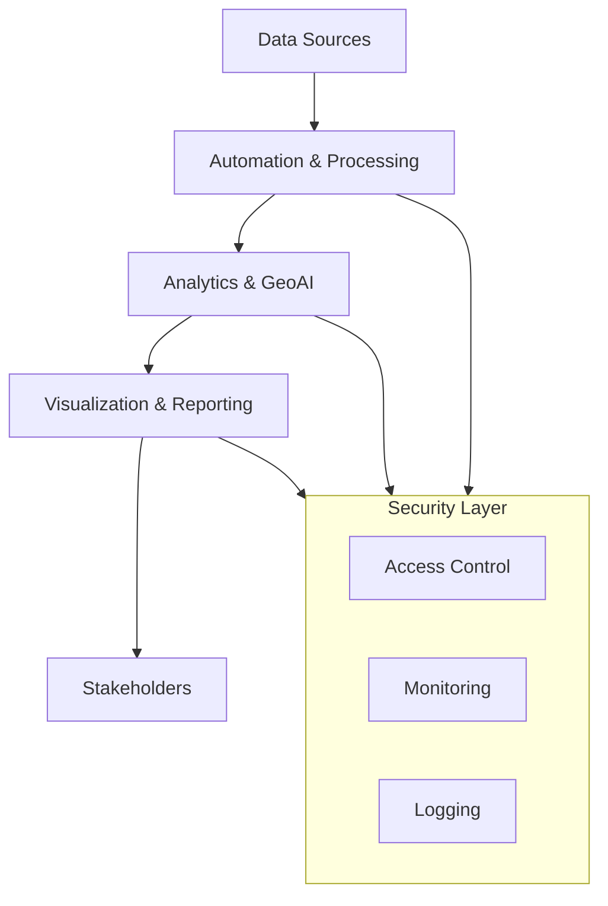

<h1 align="center">📊 Analytics • GIS–GeoAI • Public Health Intelligence Portfolio</h1>

<p align="center">
  <strong>Godwin Etim Akpan</strong><br>
  MSc Big Data Technologies (In Progress)
</p>

<p align="center">
  📍 Raleigh, North Carolina • 
  <a href="https://github.com/Jedidiah82"><strong>GitHub</strong></a> •
  <a href="https://www.linkedin.com/in/godwin-etim-akpan-822a5a43/"><strong>LinkedIn</strong></a> •
  <a href="mailto:godwineakpan1@gmail.com"><strong>Email</strong></a>
</p>

---

### 🏷️ Skill Badges
<p align="center">
  
  
  
  
  
  
  
</p>

---

## 👋 Recruiter Summary

Data & Geospatial Analyst with 10+ years of experience delivering GIS, public health intelligence, and data-driven insights across Africa and the United States.  

Skilled in **Big Data Analytics, GeoAI, Cloud Computing, Cybersecurity Analytics, and IT Automation**, with hands-on experience in outbreak surveillance, hazard mapping, distributed data processing, and secure cloud-based systems.  

Proven ability to translate complex datasets into actionable intelligence for **public health response, emergency management, infrastructure planning, and security operations**.  

Actively seeking opportunities in **Data Analytics, GIS/GeoAI, Cloud Engineering, and Cybersecurity** roles where data, automation, and security intersect.

---

## 🎯 Target Roles

I am actively pursuing opportunities in the following areas:

- Data Analyst / Data Scientist  
- GIS Analyst / GeoAI Specialist  
- Cloud Engineer (Junior–Mid Level)  
- Cloud Security Analyst  
- SOC / Cybersecurity Analyst  
- Public Health Informatics Specialist  
- Analytics Engineer  
- Infrastructure / Systems Analyst  

These roles align with my background in **data-driven decision-making, geospatial intelligence, cloud systems, security analytics, and automation**.

---

## 🚀 Portfolio Overview

This portfolio showcases applied and research-driven work at the intersection of:

- **Big Data Engineering & Distributed Machine Learning**  
- **GeoAI & Spatial Epidemiology**  
- **GIS & Remote Sensing**  
- **Cloud Computing & Security Engineering**  
- **Cybersecurity Analytics**  
- **IT Automation & Systems Engineering**  
- **Public Health Informatics**  

Projects span academic research, applied analytics, emergency management, national surveillance systems, and environmental/public health intelligence across Africa and the United States.

---

## 🧭 System-Wide Portfolio Architecture



---

## ⭐ Featured Projects

- 🔮 **[Lassa Fever GeoAI Forecasting](https://github.com/Jedidiah82/Analytics-GIS-GeoAI-Portfolio/tree/main/2_PublicHealth_GeoAI/Lassa_GeoAI_Forecasting_2016_2026)**  
  Predictive disease modeling using GeoAI and spatiotemporal analytics.

- 🌊 **[NCEM Flood Exposure Mapping](https://github.com/Jedidiah82/Analytics-GIS-GeoAI-Portfolio/tree/main/3_GIS_Spatial_DataScience/BuildingFootprint_Demo_NCEM)**  
  Hazard exposure analysis for emergency management.

- 🛡️ **[Intrusion Detection (UNSW-NB15)](https://github.com/Jedidiah82/Analytics-GIS-GeoAI-Portfolio/tree/main/1_BigData_and_ML/2_UNSW_NB15_Intrusion_Detection)**  
  Big Data cybersecurity analytics using Hive and PySpark.

- ⚙️ **[System Health Monitoring Automation](https://github.com/Jedidiah82/Analytics-GIS-GeoAI-Portfolio/tree/main/6_Automation_Reliability/System_Health_Monitoring)**  
  Automated infrastructure monitoring and alerting.

- 📄 **[Automated PDF Reporting System](https://github.com/Jedidiah82/Analytics-GIS-GeoAI-Portfolio/tree/main/6_Automation_Reliability/PDF_Report_Generation)**  
  Scheduled analytics reporting with email delivery.

---

## 🔁 DevOps & Automation Workflow


---

## 📂 Portfolio Pillars

Below are the core pillars of the portfolio, each with dedicated project folders.

---

# 1️⃣ Big Data & Machine Learning  
_📦 Spark • Hive • PySpark • ML Pipelines • Feature Engineering_

| # | Project | Tools | Focus |
|---|---------|--------|--------|
| 1 | ML on Big Data (Tasks 1a–1c) | Spark, Python, Word2Vec | Semantic embeddings & clustering |
| 2 | Intrusion Detection (UNSW-NB15) | Hive, PySpark | Cybersecurity ML pipeline |
| 3 | Language Model Discounting | PySpark, NLP | Statistical LM estimation |
| 4 | NASA Real-Time Streaming | Spark Streaming | Log analytics at scale |
| 5 | Toronto Location Intelligence | Python, Foursquare | Spatial business analytics |

---

# 2️⃣ Public Health GeoAI & Spatio-Temporal Modeling  
_📦 Disease Forecasting • Hotspot Modeling • Surveillance Analytics_

| Project | Tools | Focus |
|---------|--------|--------|
| Lassa Fever GeoAI Forecasting | Python, XGBoost, Prophet, GeoPandas | Predictive modeling (2016–2026) |
| Epidemiological Publications | R, GIS | Peer-reviewed public health research |
| Spatial Epidemiology Studies | ArcGIS, Python | Clustering & temporal trends |

---

# 3️⃣ GIS, Spatial Data Science & Remote Sensing  
_📦 ArcGIS Pro • QGIS • Remote Sensing • Raster Analytics_

| Project | Tools | Focus |
|---------|--------|--------|
| NCEM Building Footprint Flood Exposure | GeoPandas, ArcGIS | Hazard impact QC & mapping |
| Road Network Digitization | ArcGIS | Infrastructure mapping |
| Crash Hotspot Analysis | KDE, ArcGIS | Transportation safety |
| Land Degradation Analysis | Sentinel-2, NDVI | Environmental monitoring |
| Sea Level Rise (3D) | ArcGIS Pro | Climate visualization |
| Airport Site Suitability | GIS/MCDA | Infrastructure planning |
| Africa FETP Implementation Map | ArcGIS Online | Epidemiology workforce |
| AFENET Public Health Footprint | GIS | Multi-project mapping |
| OneHealth RCCE Stakeholder Map | KoboToolbox + GIS | Preparedness mapping |
| Emergency Preparedness Training Map | GIS | Disaster readiness |

---

# 4️⃣ Cloud Computing & Security Engineering (In Progress)

_📦 AWS • Azure • GCP • IAM • Cloud Security • SIEM • Threat Detection_

### ☁️ Cloud Platforms
- AWS (EC2, S3, IAM, VPC)  
- Azure (AD, Resource Groups)  
- GCP (IAM, Compute)  

### 🔐 Cloud Security
- Identity & Access Management  
- Threat detection & SIEM integration  
- CIS hardening foundations  
- Network segmentation & secure VPC design  
- Compliance-aligned configurations  

### 🛡 Cybersecurity Analytics
- Splunk log analysis & alert tuning  
- Threat intel (VirusTotal, GreyNoise)  
- Email investigations & phishing detection  
- Malware triage support  
- Vulnerability assessment fundamentals  

> _📌 This section will expand with cloud labs, architecture diagrams, and security engineering projects._

---

# 5️⃣ Microsoft Fabric & Power BI (Developing Competency)

- Fabric Lakehouse & Delta architecture  
- Power BI modeling, DAX, semantic modeling  
- Real-Time Analytics in Fabric  
- Data Pipelines & Dataflows  
- End-to-end analytics engineering workflows  

---

<h2>6️⃣ Automation, Reliability &amp; Secure Data Systems</h2>

<p><em>📦 Python • APIs • System Monitoring • Reporting • Workflow Automation</em></p>

<p>
  This pillar demonstrates how automation enhances <strong>secure, scalable, and reliable</strong>
  data operations for geospatial, public health, and cloud-based systems.
</p>

<table>
  <thead>
    <tr>
      <th>Project</th>
      <th>Tools</th>
      <th>Focus</th>
    </tr>
  </thead>
  <tbody>
    <tr>
      <td>System Health Monitoring</td>
      <td>Python, psutil, SMTP</td>
      <td>Proactive infrastructure alerts</td>
    </tr>
    <tr>
      <td>Automated Report Generation</td>
      <td>Python, ReportLab</td>
      <td>PDF analytics reporting</td>
    </tr>
    <tr>
      <td>Image Processing Pipeline</td>
      <td>PIL, APIs</td>
      <td>Data standardization</td>
    </tr>
    <tr>
      <td>Secure File Upload Scripts</td>
      <td>Requests, REST APIs</td>
      <td>Cloud-ready ingestion</td>
    </tr>
    <tr>
      <td>Email Automation System</td>
      <td>Python, SMTP</td>
      <td>Operational communication</td>
    </tr>
    <tr>
      <td>Log Processing Scripts</td>
      <td>Python</td>
      <td>Reliability engineering</td>
    </tr>
  </tbody>
</table>

<p><em>These projects support secure GeoAI, public health analytics, and cloud-enabled systems.</em></p>

<p><strong>🧪 Lab Source:</strong>  
Automation projects are based on the Google IT Automation with Python Professional Certificate.</p>


<h3>Focus Areas</h3>
<ul>
  <li>Automation for data pipelines</li>
  <li>System reliability &amp; monitoring</li>
  <li>Secure communication workflows</li>
  <li>API-driven data exchange</li>
  <li>Operational efficiency</li>
</ul>

<p><em>These projects support secure GeoAI, public health analytics, and cloud-enabled systems.</em></p>

---

## 🧠 Technical Skills Overview

**Data & ML:**  
Python • Spark • Hive • SQL • Pandas • GeoPandas • XGBoost • Prophet • scikit-learn  

**GIS & GeoAI:**  
ArcGIS Pro • ArcGIS Online • QGIS • Shapely • Rasterio • Remote Sensing  

**Public Health Analytics:**  
DHIS2 pipelines • Epidemiological modeling • Outbreak dashboards  

**Cloud:**  
AWS • Azure • GCP • IAM • VPC • Cloud Security  

**Cybersecurity:**  
Splunk • Nessus • Wireshark • Nmap • Maltego • OSINT Tools  

**Automation & Systems:**  
Python • Linux • Bash • Regex • Log Analysis • Monitoring • Reporting  

**Visualization:**  
ArcGIS Dashboards • Matplotlib • Seaborn • Power BI • Fabric Visuals  

---

## 🧩 Skills Matrix (Role-Aligned)

| Skill Area | Tools & Technologies | Proficiency | Evidence |
|-----------|----------------------|------------|----------|
| Data Analytics | Python, Pandas, SQL, Power BI, Fabric | Advanced | Public health dashboards, analytics reports |
| Big Data | Spark, Hive, PySpark, Hadoop | Advanced | UNSW-NB15 intrusion detection, streaming labs |
| GIS & GeoAI | ArcGIS Pro, QGIS, GeoPandas, Remote Sensing | Expert | NCEM flood mapping, AFENET projects |
| Public Health Informatics | DHIS2, Surveillance Dashboards, R | Advanced | Lassa Fever forecasting, epidemiology studies |
| Cloud Computing | AWS, Azure, GCP, OpenStack | Intermediate | EC2 CLI lab, Azure Web App, Datastore |
| Cybersecurity | Splunk, Nessus, Wireshark, IAM | Intermediate | SOC training, crypto labs |
| Automation | Python, Bash, APIs, Monitoring | Intermediate | System health monitoring, reporting pipelines |
| Visualization | ArcGIS Dashboards, Matplotlib, Seaborn | Advanced | Maps, plots, executive dashboards |

---

## 🔄 Reproducibility

Each project folder includes:

- `README.md`  
- Python scripts  
- Jupyter Notebooks  
- `figures/` (maps, plots, charts)  
- `data_template/`  
- GIS boundaries  

Install dependencies:

```bash
pip install -r requirements.txt
```

---

## 🧭 Future Additions
- Large-scale GeoAI using Spark
- Automated Lassa Fever EWS dashboard
- Hazard dashboards (NCEM-style)
- AWS Security Engineering labs
- Cloud + GeoAI integrated workflows
- Public health early warning systems

## © 2025 – Godwin Etim Akpan
**Big Data • GeoAI • GIS • Cloud Security • IT Automation • Public Health Informatics**