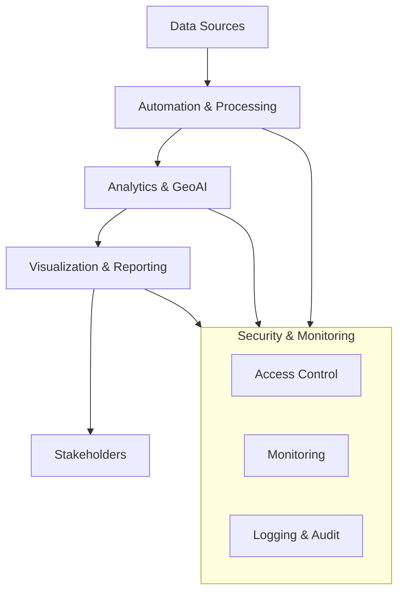
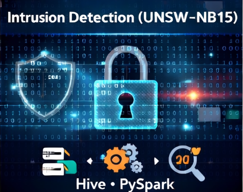
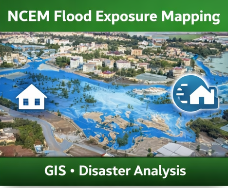
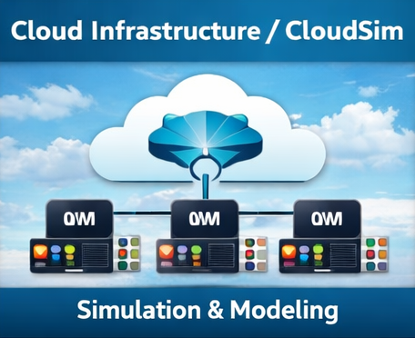
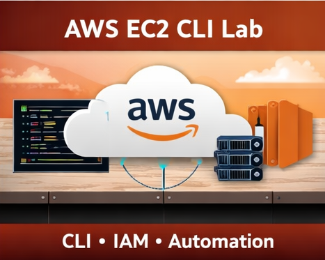
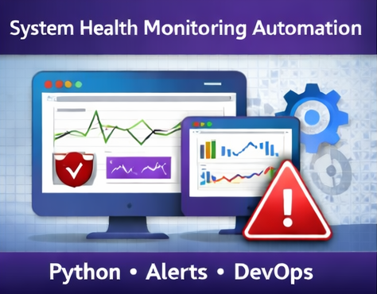

<h1 align="center">📊 Godwin Etim Akpan</h1>

<p align="center">
  <strong>Applied Data Science • GIS–GeoAI • Big Data • Cloud • Cybersecurity • Public Health Intelligence</strong>
</p>

<p align="center">
  <em>Driving intelligence-led solutions at the intersection of data, geography, and security for public health and infrastructure resilience.</em>
</p>

<p align="center">
  📍 Raleigh, NC, USA |
  <a href="https://github.com/Jedidiah82/Analytics-GIS-GeoAI-Portfolio">Portfolio</a> |
  <a href="https://www.linkedin.com/in/godwin-etim-akpan-822a5a43/">LinkedIn</a> |
  <a href="mailto:godwineakpan1@gmail.com">Email</a>
</p>

<p align="center">
  
  
  
  
  
</p>

<p align="center">
  
  
  
</p>

---

## Professional Summary

Data & Geospatial Analytics professional with **10+ years of experience** delivering **GIS-driven intelligence, large-scale analytics, and decision-support systems** across Africa and the United States.

I specialize in **GeoAI, Big Data Analytics, Cloud Computing, Cybersecurity Analytics, and IT Automation**, with hands-on experience in **outbreak surveillance, hazard mapping, distributed data pipelines, and secure cloud environments**.

---

## Domains of Expertise

**Data Analytics • GIS/GeoAI • Big Data Engineering • Cloud Engineering • Cybersecurity Analytics • Public Health Informatics • Automation**

---

## Leadership & Impact

- Delivered GIS-driven intelligence systems supporting surveillance and emergency response  
- Built spatio-temporal forecasting workflows for outbreak prediction and risk modeling  
- Developed secure data pipelines and dashboards for operational decision-making  
- Translated multi-source datasets into actionable insights for technical and non-technical stakeholders  
- Operated effectively in high-impact, resource-constrained environments across multiple countries  

---

## Portfolio Overview

This portfolio showcases applied and research-driven work across:

- **Big Data Engineering & Distributed Machine Learning**  
- **GeoAI & Spatial Epidemiology**  
- **GIS & Remote Sensing**  
- **Cloud Computing & Security Engineering**  
- **Cybersecurity Analytics**  
- **IT Automation & Systems Engineering**  
- **Public Health Informatics**  

---

## System-Wide Architecture



---

## Featured Projects <a name="featured-projects"></a>

### Lassa Fever GeoAI Forecasting  
[](https://github.com/Jedidiah82/Analytics-GIS-GeoAI-Portfolio/tree/main/2_PublicHealth_GeoAI/Lassa_GeoAI_Forecasting_2016_2026)

Spatio-temporal disease forecasting using **ARIMA, Prophet, STL, and XGBoost**.  
🔗 [View Project](https://github.com/Jedidiah82/Analytics-GIS-GeoAI-Portfolio/tree/main/2_PublicHealth_GeoAI/Lassa_GeoAI_Forecasting_2016_2026)

---

### Intrusion Detection (UNSW-NB15)  
[](https://github.com/Jedidiah82/Analytics-GIS-GeoAI-Portfolio/tree/main/1_BigData_and_ML/2_UNSW_NB15_Intrusion_Detection)

Big Data cybersecurity analytics using **Hive & PySpark**.  
🔗 [View Project](https://github.com/Jedidiah82/Analytics-GIS-GeoAI-Portfolio/tree/main/1_BigData_and_ML/2_UNSW_NB15_Intrusion_Detection)

---

### NCEM Flood Exposure Mapping  
[](https://github.com/Jedidiah82/Analytics-GIS-GeoAI-Portfolio/tree/main/3_GIS_Spatial_DataScience/BuildingFootprint_Demo_NCEM)

Hazard exposure modeling for emergency preparedness and response.  
🔗 [View Project](https://github.com/Jedidiah82/Analytics-GIS-GeoAI-Portfolio/tree/main/3_GIS_Spatial_DataScience/BuildingFootprint_Demo_NCEM)

---

### CloudSim Performance Lab  
[](https://github.com/Jedidiah82/Analytics-GIS-GeoAI-Portfolio/tree/main/4_Cloud_Computing_Security/cloudsim-performance-lab)

Cloud performance simulation & infrastructure modeling.  
🔗 [View Project](https://github.com/Jedidiah82/Analytics-GIS-GeoAI-Portfolio/tree/main/4_Cloud_Computing_Security/cloudsim-performance-lab)

---

### AWS EC2 CLI Lab  
[](https://github.com/Jedidiah82/Analytics-GIS-GeoAI-Portfolio/tree/main/4_Cloud_Computing_Security/aws-ec2-cli-lab)

AWS provisioning and management using CLI with IAM foundations.  
🔗 [View Project](https://github.com/Jedidiah82/Analytics-GIS-GeoAI-Portfolio/tree/main/4_Cloud_Computing_Security/aws-ec2-cli-lab)

---

### System Health Monitoring Automation  
[](https://github.com/Jedidiah82/Analytics-GIS-GeoAI-Portfolio/tree/main/6_Automation_Reliability/System_Health_Monitoring)

Python-based monitoring, alerting, and reliability automation.   
🔗 [View Project](https://github.com/Jedidiah82/Analytics-GIS-GeoAI-Portfolio/tree/main/6_Automation_Reliability/System_Health_Monitoring)

---

## 🧱 Portfolio Pillars (Explore by Area)

- **[1️⃣ Big Data & Machine Learning](https://github.com/Jedidiah82/Analytics-GIS-GeoAI-Portfolio/tree/main/1_BigData_and_ML)**  
  Spark • Hive • PySpark • ML Pipelines • Feature Engineering  

- **[2️⃣ Public Health GeoAI & Spatio-Temporal Modeling](https://github.com/Jedidiah82/Analytics-GIS-GeoAI-Portfolio/tree/main/2_PublicHealth_GeoAI)**  
  Disease Forecasting • Hotspot Modeling • Surveillance Analytics  

- **[3️⃣ GIS, Spatial Data Science & Remote Sensing](https://github.com/Jedidiah82/Analytics-GIS-GeoAI-Portfolio/tree/main/3_GIS_Spatial_DataScience)**  
  ArcGIS • GeoPandas • Remote Sensing • Spatial Modeling  

- **[4️⃣ Cloud Computing & Security Engineering](https://github.com/Jedidiah82/Analytics-GIS-GeoAI-Portfolio/tree/main/4_Cloud_Computing_Security)**  
  AWS • Azure • GCP • IAM • SIEM • Threat Detection  

- **[5️⃣ Data Engineering & Analytics Engineering](https://github.com/Jedidiah82/Analytics-GIS-GeoAI-Portfolio/tree/main/5_Data%20%26%20Analytics%20Engineering)**  
  ETL/ELT • Spark • Orchestration • Lakehouse Patterns • Microsoft Fabric  

- **[6️⃣ Automation, Reliability & Secure Systems](https://github.com/Jedidiah82/Analytics-GIS-GeoAI-Portfolio/tree/main/6_Automation_Reliability)**  
  Python Automation • Monitoring • Reporting • APIs  

---

## Technical Skills

- **Data & Machine Learning:**  
  Python, Spark, PySpark, Hive, SQL, scikit-learn, XGBoost, Prophet  

- **Data Engineering:**  
  ETL/ELT pipelines, data modeling, Spark, Hive, SQL, data warehousing, distributed systems  

- **GIS & GeoAI:**  
  ArcGIS Pro/Online, GeoPandas, Remote Sensing, Spatial Modeling  

- **Cloud Computing:**  
  AWS, Azure, GCP, IAM, VPC, secure cloud architecture patterns  

- **Cybersecurity Analytics:**  
  Splunk, SIEM concepts, log analysis, detection fundamentals  

- **Automation & Systems:**  
  Python automation, Linux, APIs, monitoring and alerting  

- **Analytics Engineering (Developing):**  
  Microsoft Fabric, Power BI, lakehouse architecture, semantic modeling   

---

## Certifications & Training (Selected)

- CompTIA CySA+  
- CompTIA Security+ (CE)  
- Splunk Core Certified User  
- Google IT Automation with Python  
- IBM Data Science Professional Certificate  

### In Progress

- IBM Data Engineering Professional Certificate  
- Microsoft Fabric & Power BI Certifications *(DP-600, DP-700, PL-300)*  

### Public Health & Leadership

- Field Epidemiology Training Program (FETP)  
- Project Management in Global Health (University of Washington)   

---

## Reproducibility

Each project folder includes *(as applicable)*:

- `README.md`  
- Notebooks and scripts  
- `figures/` *(maps, plots, charts)*  
- `data_template/` *(sample or synthetic data when required)*  

### Install Dependencies

```bash
pip install -r requirements.txt
```

---

## Vision

To advance public health, resilient infrastructure, and secure digital systems through the integration of **GeoAI, advanced analytics, and cloud-native technologies**.

---
**© 2025 Godwin Etim Akpan**  
Data Analytics • GeoAI • Cloud • Cybersecurity • Public Health Intelligence  
