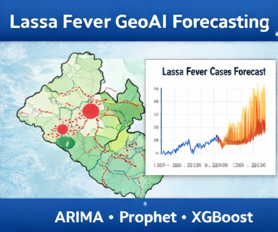

# 📊 Godwin Etim Akpan  
**Data Analytics • GIS–GeoAI • Cloud • Cybersecurity • Public Health Intelligence**

📍 Raleigh, NC, USA | [Portfolio](https://github.com/Jedidiah82/Analytics-GIS-GeoAI-Portfolio) | [LinkedIn](https://www.linkedin.com/in/godwin-etim-akpan-822a5a43/) | [Email Me](mailto:godwineakpan1@gmail.com)  

---

## 👋 Professional Summary

Data & Geospatial Analyst with 10+ years of experience delivering GIS, public health intelligence, and data-driven solutions across Africa and the United States.

Highly skilled in **Big Data Analytics and GeoAI**, with strong experience in **Cloud Computing (AWS, Azure, GCP), Cybersecurity Analytics, and IT Automation**, including outbreak surveillance, hazard mapping, distributed data processing, and secure cloud-based systems.

Focused on turning complex data into **actionable intelligence** for public health, emergency response, infrastructure planning, and security operations.

---

## 🎯 Career Focus

**Data Analytics • GIS/GeoAI • Cloud Engineering • Cybersecurity Analytics • Public Health Informatics**

---

## ⭐ Featured Projects

### 🦠 Lassa Fever GeoAI Forecasting  
Spatio-temporal disease forecasting using **ARIMA, Prophet, STL, and XGBoost**.  
**Focus:** Public Health, GeoAI, Forecasting  
🔗 [View Project](https://github.com/Jedidiah82/Analytics-GIS-GeoAI-Portfolio/tree/main/2_PublicHealth_GeoAI/Lassa_GeoAI_Forecasting_2016_2026)

### 🦠 Lassa Fever GeoAI Forecasting  
Spatio-temporal disease forecasting using **ARIMA, Prophet, STL, and XGBoost**.

---

### 🛡 Intrusion Detection (UNSW-NB15)  
Big Data cybersecurity analytics using **Hive & PySpark**.  
**Focus:** SOC, ML, Threat Detection  
🔗 [View Project](https://github.com/Jedidiah82/Analytics-GIS-GeoAI-Portfolio/tree/main/1_BigData_and_ML/2_UNSW_NB15_Intrusion_Detection)

---

### 🌊 NCEM Flood Exposure Mapping  
GIS-based hazard exposure analysis for emergency response.  
**Focus:** GIS, Disaster Analytics  
🔗 [View Project](https://github.com/Jedidiah82/Analytics-GIS-GeoAI-Portfolio/tree/main/3_GIS_Spatial_DataScience/BuildingFootprint_Demo_NCEM)

---

### ☁️ Cloud Infrastructure / CloudSim  
Cloud performance simulation & infrastructure modeling.  
**Focus:** Cloud Engineering  
🔗 [View Project](https://github.com/Jedidiah82/Analytics-GIS-GeoAI-Portfolio/tree/main/4_Cloud_Computing_Security/cloudsim-performance-lab)

---

### ⚙️ AWS EC2 CLI Lab  
Hands-on AWS infrastructure provisioning and management using CLI.  
**Focus:** Cloud Engineering, IAM, Automation  
🔗 [View Project](https://github.com/Jedidiah82/Analytics-GIS-GeoAI-Portfolio/tree/main/4_Cloud_Computing_Security/aws-ec2-cli-lab)

---

### 🔧 System Health Monitoring Automation  
Python-based system monitoring with alerts and reliability engineering.  
**Focus:** DevOps, Automation, Monitoring  
🔗 [View Project](https://github.com/Jedidiah82/Analytics-GIS-GeoAI-Portfolio/tree/main/6_Automation_Reliability/System_Health_Monitoring)

---

## 🧠 Core Skill Areas

- **Data Science & ML:** Python, Spark, PySpark, XGBoost  
- **GIS & GeoAI:** ArcGIS, GeoPandas, Remote Sensing  
- **Cloud:** AWS, Azure, GCP, OpenStack  
- **Cybersecurity:** Splunk, SIEM, IDS  
- **Automation:** Python, APIs, Monitoring  

---

## 🧭 Portfolio Pillars

- Big Data & Machine Learning  
- Public Health GeoAI  
- GIS & Spatial Data Science  
- Cloud Computing & Security  
- Automation & Reliability  

---

## 👤 About the Author

**Godwin Etim Akpan**  
Data Analytics • GIS–GeoAI • Cloud • Cybersecurity • Public Health Intelligence  

© 2025
